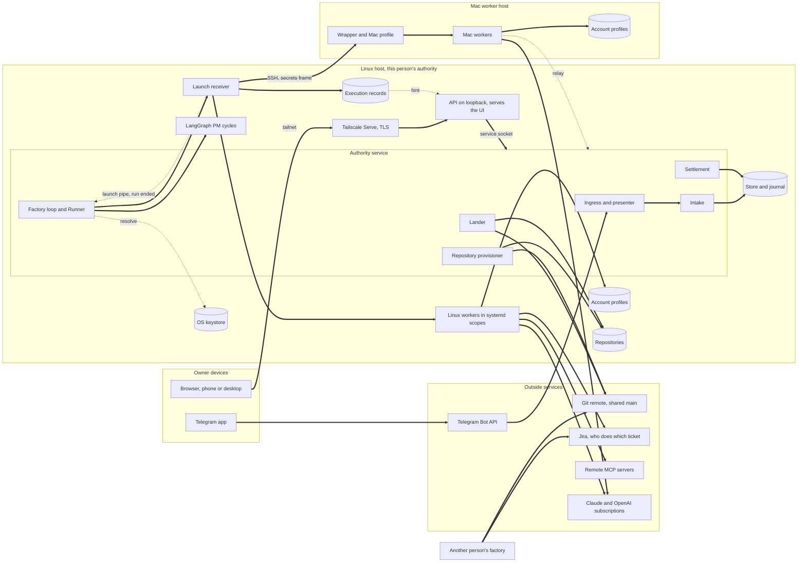

# PLAN-0019: the factory's operating model

**Status.** Approved by the owner on 2026-09-25 (Telegram 29162, "all 6 are yes") at revision 2
(`12879d3`, whose status line names revision 2), with the open decision of section 15 answered yes for
both engines (Telegram 29163, "yes, Codex and Claude can read creds"). Since `12879d3` this text has
changed in two ways only. It records that answer: the organization note below, sections 3, 6, 10, 12,
13 and 14 and section 15 itself move login separation to Release 2 for both engines, with the Claude
sandbox denial and the `socat` install. And the review of PLAN-0019 revision 4 split the factory loop
out of VELDO-0129, so sections 1, 4, 11, 12 and 14 name it VELDO-0154 where they named VELDO-0129 AC4.
Sections 8 and 11 still cite VELDO-0062 AC5 for the account pool, as approved; the pool is now VELDO-0160.
And the owner replaced the keyword rule for new-project requests with routing by the factory PM (Telegram
29186, 29187 and 29191, 2026-09-26), so sections 2 and 5 and the VELDO-0126 amendment now describe that
routing, in which a project name in the text is a hint and never decides, and section 15 marks the
whole-words rule as replaced.
Nothing else changed. It was written against origin/main `c1fd591` and the branches named below.
Revision 2 answered the adversarial review of revision 1 (`6416eb8`) and folded in the owner's decision
of the same day that each person runs their own factory (Telegram 29146, 29147); section 14 maps every
review finding to what changed, and `12879d3` applied the second check recorded at the end of section 15
within revision 2. This document designs the
owner's operating requirements of 2026-09-25 (Telegram 29122, 29126, 29127 and 29128) on top of what
PLAN-0019 revision 3 and its controlling design (R01 to R76) already built or specified. It changes no
code. Once approved, it governs the areas below; where it and the controlling design disagree on those
areas, this document wins, and PLAN-0019 revision 4 records the change in its constraint C1.

**How it is organized.** One section for each requirement area, each in the same six parts: (a) the
requirement, (b) what already exists and is reused, (c) the gap, (d) the design, (e) the changes it
implies, mapped to specifications, and (f) what is deliberately not built now. Then one end-to-end
walkthrough, the MVP critical path, the risks, the response to the review and the owner's decision on engine logins.
Every new component is tied to a requirement; everything else is reuse.

**Four decisions run through the whole design.** First, every model invocation is an ordinary
dispatched worker run: the project manager's reasoning, requirements elaboration, building and review
all go through the same Runner (VELDO-0039), so all of them use the account pool, obey the usage caps,
run contained and appear in the live terminal view. Second, the factory's own Git operations never run
inside a worker: creating a repository, pushing and storing a credential are trusted effects of the
authority service on the owner's settled answer. Third, each person runs their own factory, holding the
repositories of their own Git identities, with their own logins, keystore, keys and Telegram; factories
coordinate only through Jira and the shared Git main. Fourth, the MVP keeps every product function and
defers only hardening; where this design cannot yet prove a protection, it says so instead of implying it.

## 1. The shape of the factory

**Deployment view.** A factory belongs to one person. It runs on that person's Linux host, with an
optional Mac worker host for macOS and iOS work, and is used from their phone and desktop over their
tailnet. Everything secret in it is theirs alone: the provider logins, the OS keystore, SSH keys, MCP
credentials and the Telegram bot. There is no shared multi-user factory and no multi-tenant server. Two
people working on the same code each run a factory; which ticket each takes is decided by them in Jira,
and Git main on the shared remote is the one truth their factories meet at, so each factory must land
cleanly when another one moved main in the meantime (section 7). The authority model's several
principals and membership scopes remain, for a project two people co-own inside one factory, not for
hosting other people's factories.

The table lists every component the MVP needs, where it runs, and its state today.

| Component | Runs on | What it does | State |
|-|-|-|-|
| Authority service | Linux, systemd user unit | Store and journal, command socket, the one scheduling instance | Built: VELDO-0047, VELDO-0139 |
| Telegram ingress and presenter | Inside the authority service | Acquires messages, sends presentations and reports | Built: VELDO-0073, VELDO-0138; reports VELDO-0128 being built |
| Intake | Inside the authority service | One normalized command for every channel | Built: VELDO-0126; amended here |
| Settlement and decision binding | Inside the authority service | Each answer settles once, from any channel | Built: VELDO-0068, VELDO-0069; standing delegation VELDO-0140 being built |
| Factory loop and Runner | Inside the authority service | Woken by commits, run ends and reset timers: starts PM cycles, dispatches units | New specification: VELDO-0154 (from VELDO-0129 AC4) |
| PM cycle runner | Linux, isolated LangGraph runtime | Executes the bound workflow revision one judged step at a time | Built: VELDO-0132, VELDO-0043, VELDO-0045; PM graphs VELDO-0088 unbuilt |
| Launch receiver | Linux, a process the Runner starts | Spawns the contained worker, feeds and reaps it, writes the record | Built: VELDO-0039 to VELDO-0042; account choice VELDO-0062 |
| Execution record | Linux files written by the receiver | Every event, output line and error of every run, redacted, in order | Draft: VELDO-0141 |
| Capability handoff | Inside the receiver and engine adapters | Generates each run's exact MCP, tool, skill and instruction configuration | VELDO-0127, VELDO-0060, VELDO-0061 unbuilt |
| MCP catalog and credential store | Store records; OS keystore on Linux | Server definitions once; secrets by reference only | New: VELDO-0144 |
| Repository provisioner | Trusted effect in the authority service | Creates or adopts a repository under one Git identity | New: VELDO-0143, VELDO-0142 |
| Lander | Linux | Publishes exactly the tested tree, re-landing on a moved main | Built: VELDO-0056 to VELDO-0058; re-land amended here; identity VELDO-0142 |
| API | Linux loopback behind Tailscale Serve | Reads, messages, answers, configuration, live streams; serves the UI | Built: VELDO-0130; new route families come with their owning specs |
| UI | Owner's browser on phone and desktop | Every screen of the journey, including the live terminal | Unbuilt: first slice VELDO-0145, the rest VELDO-0131 |
| Mac worker host | Mac, reached over SSH | Trusted wrapper, Mac profile, clones, account profiles; commands back through the relay | Unbuilt: VELDO-0124, VELDO-0125; relay VELDO-0108 built |



## 2. Work starts from a message on any channel

**(a) Requirement.** Work starts from a message on any channel, Telegram now and others later. The
message either describes the work or points at something elsewhere (a Jira ticket, a Confluence page,
an API); agents fetch the referenced material themselves with their local access and MCP servers, and
neither the channel nor the referenced system changes how the factory works.

**(b) What exists and is reused.** VELDO-0126 (landed) turns a Telegram message or an authenticated API
call into one normalized intake command that keeps the source identity, the exact text, the
authenticated principal and the project context. It picks the project the API request names, else the
one candidate the text names as a word, else the principal's only candidate; when none decides, it keeps
an inbox proposal and asks which project. It requires no ticket identifier, never admits or prioritizes,
and follows a reply onto the live objective. VELDO-0066 binds the platform message id, sender and time;
VELDO-0067 gives each channel edge its own signing key; VELDO-0073 and VELDO-0138 run the Telegram
ingress inside the service; the UI message box is VELDO-0130's message route into the same intake.
Constraint C7 already rules out watchers, polling and webhooks.

**(c) Gap.** When a message points at a ticket, nothing keeps what the agent actually read, so a ticket
edited after the fetch drifts the requirement silently and the reviewer has nothing fixed to judge
against. Nothing says what happens when no configured tool reaches the referenced system. "Any channel"
has no written adapter contract. And once the owner has two projects, "please do BCG-123" gets intake's
"which project?" every time, because a ticket key names no project.

**(d) Design.** A **channel adapter** is five operations against modules that already exist: acquire a
message from the platform, attribute it (VELDO-0066), sign it at its own edge (VELDO-0067), submit it to
intake (VELDO-0126), and present requests and reports back (VELDO-0065). Adding a channel means
implementing those five and enrolling its edge; nothing downstream changes.

| Operation | Telegram today | What a later channel supplies |
|-|-|-|
| Acquire | The Bot API's getUpdates exchange in the ingress | Its platform's delivery |
| Attribute | Platform message id, sender id, platform time | The same three facts from its platform |
| Sign | Telegram edge key | Its own edge key |
| Submit | Intake source kind `telegram` | A new source kind |
| Present and report | Presenter with reply threading | Its own rendering of the same presentation |

**Referenced material** is fetched by the run that writes the requirements (section 4), with the tools
its role lists. The requirements document that run already publishes quotes each fetched item in full,
with the reference as the owner wrote it, the server and tool used, the fetch time and a content digest.
Specifications cite that document, so review judges against fixed text. A later edit to the ticket is
new input only when the owner sends a message about it. When no tool in the role's configuration
reaches the reference, the run asks the owner through an ordinary decision request naming the
reference and the missing capability; nothing proceeds on the plain text alone.

**Ticket keys name projects.** A project record gains an optional list of ticket key prefixes, for
example `BCG`. A ticket key in the text whose prefix exactly one candidate lists decides the project. A
project's name in the text does not: it is a hint to the factory PM (section 5, VELDO-0152).

**(e) Changes.** Amend VELDO-0091 AC1: the requirements document quotes every external reference in the
objective's messages with reference, tool, fetch time and digest, and a reference no configured tool
reaches becomes an owner question. Amend VELDO-0126 AC1: a ticket key whose prefix exactly one candidate
lists names that candidate (the new-project amendment is in section 5).

**(f) Not built now.** Channels other than Telegram and the API (a Release 4 choice), any watcher,
webhook or polling of the referenced systems, a factory-side fetcher, and automatic re-fetch when a
ticket changes.

## 3. MCP servers are configured in the UI, credentials live in the OS keystore

**(a) Requirement.** MCP servers are defined in the UI and saved. Their credentials live in the local
OS keystore, and a cloud keystore replaces it later if the factory runs in the cloud.

**(b) What exists and is reused.** VELDO-0127 (ready, unbuilt) specifies versioned per-role
configuration with MCP server identities, commands, arguments, settings and protected credential
references, and an exact handoff that neither drops nor adds a capability. `.veldo/secretref.py`
(PLAN-0013) names a secret by a reference such as `keychain:<name>` and resolves it only at use into a
handle that never prints its value; it has schemes env, keychain, file, vault and ssm but only a test
store behind them. `.veldo/secret_scan.py` detects credential shapes and high-entropy strings.
VELDO-0130 has a configuration route family, passkey sessions and redaction by field name and scanner.

**(c) Gap.** There is no catalog: VELDO-0127 embeds each server's definition in every role that uses it.
No real keystore adapter exists, no path takes a secret from the UI to a keystore, and nothing delivers
a value to a Mac run.

**(d) Design.** Definition is split from selection. The **MCP server catalog** is a record family in
the store, versioned the way VELDO-0132 versions workflows: every save is a new immutable revision.
Roles select servers from it by id and revision (section 6). Every server is an ordinary stdio or http
server with its credential in the keystore, Atlassian included; the claude.ai connectors are not used,
because Claude Code turns them off under the strict MCP mode the handoff needs (section 6), and an
ordinary server also works for Codex.

| Field of `mcp_server` | Meaning |
|-|-|
| id, revision, label | Identity and version; a save never overwrites |
| transport | `stdio` or `http` |
| command and arguments | For stdio servers |
| url | For http servers |
| environment | Name to value, where a value is a literal or a credential reference |
| headers | For http servers, name to credential reference |
| hosts | Hosts the server can run on (Linux, Mac) |
| read-only tools | The server's tools the owner marks as changing nothing outside the run, such as Jira reads (section 8) |

**A credential** has two halves. The value lives only in the OS keystore of the authority host. The
store keeps a `credential` record with id, label, reference, set at and set by, and nothing else. On
Linux the keystore is the Secret Service of the GNOME keyring daemon already running in the owner's
session, reached through the `secret-tool` executable from the distribution's libsecret-tools package
(0.21.4 in this release's archive, not yet installed; GNOME's libsecret, LGPL-2.1+ with GPL-2+ parts,
run as a separate process and never linked). This realizes secretref's keychain scheme; a cloud factory
later resolves the same references through the vault or ssm scheme with nothing else changed.

**Saving a credential.** The UI's server form has write-only credential fields. The value travels once,
over TLS from Tailscale Serve inside the owner's passkey session, to the API's credential route, which
passes it to the authority like every other API command. The authority's credential command writes the
value to the keystore through `secret-tool`'s standard input and commits the record, which carries the
reference only; the command's observation and journal entry exclude the value field by name. The value
never enters the store, the journal, the event feed, proof, logs or any command line. The UI can replace
or delete a value but never read one back.

**Delivering it to a Linux run.** Immediately before a spawn, the Runner resolves the references the
dispatch's configuration uses and the receiver writes the engine's generated configuration, values
included, into the run's private directory: mode 0700, under the factory state root, outside the clone,
removed when the run is reaped. For Claude Code that is the MCP configuration file. For Codex, whose
`CODEX_HOME` is the account profile and whose configuration option would put values on the command
line, the non-secret configuration is generated as usual and each secret reaches the engine's
environment under a name the server definition refers to through Codex's `env_vars` or
`bearer_token_env_var` fields, never through a command-line value.

**Delivering it to a Mac run.** The wrapper execs into the engine right after its identity line, and
the packet the receiver writes afterward becomes the engine's standard input and is built from the
contract the journal records, so neither can carry a secret. A Mac run therefore gets a **secrets
frame**: after the release and before the wrapper execs, the receiver writes one frame over the same SSH
channel holding the resolved values; the wrapper reads exactly that frame, writes the Mac run's private
file (the same layout, mode 0600 in a 0700 directory), and only then execs. Because the wrapper becomes
the engine, the receiver removes that directory over SSH when the run ends. The frame is never part of
the packet, the contract or the journal, which records only the credential ids delivered. Nothing is
written to the Mac's keychain. A locked or unreachable keystore, or a reference that does not resolve,
refuses the launch by name (`credential_unavailable:<id>`); the run never starts without the server.

**Redaction by exact value.** The receiver knows every value it resolved for a run, so it replaces those
exact values in every record line before the pattern and entropy scanner runs (section 7).

**The honest boundary.** A worker's tools run as the same OS user as its MCP servers, so in the MVP a
worker that tries can read the credentials its own servers use, from its generated configuration or
its environment, and its own provider login (section 6: the owner moved login separation to Release 2
for both engines, Telegram 29163). Beyond that, the
trusted wrapper strips `SSH_AUTH_SOCK`, `SSH_AGENT_PID`, `DBUS_SESSION_BUS_ADDRESS`, `GH_TOKEN` and
`GITHUB_TOKEN` from the engine's environment just before it execs the engine, so `systemd-run` and
`systemctl` keep the receiver's environment and still reach the user manager; the engine's
`XDG_RUNTIME_DIR` points at an empty directory of its own, never the one holding the generated
credentials, so the session bus fallback path finds nothing. Today the receiver passes its whole
environment through.
That removes the accidental routes to the keystore and the SSH agent, not the deliberate ones: the
keyring daemon is an unconfined process of the owner's account that serves every item over D-Bus, and
Landlock custody is not a defense against such a process. So a worker that tries can still reach the
keystore and the agent's keys in the MVP. "By construction" holds only for the factory's own Git
operations. Running MCP servers and tools under separate OS users is Release 2 hardening.

**(e) Changes.** New **VELDO-0144**: *MCP servers are defined once through the UI as versioned records,
and their credentials are written to and read from the host OS keystore only.* Its criteria cover
versioned catalog saves through a typed API route and the authority's command, the keystore write and
resolve path with no value in store, journal, proof, logs or command lines, the Linux file and Codex
environment routes and the Mac secrets frame, and the named refusal when the keystore is locked or a
reference is missing. Amend VELDO-0127 AC1 so server definitions are catalog references. VELDO-0131
gains the "MCP servers and credentials" screen row.

**(f) Not built now.** A cloud keystore, per-run OS users, credential rotation reminders, the claude.ai
connectors, storing MCP credentials in the Mac keychain, and a connection test button.

## 4. A project manager coordinates each piece of work and decides who is needed

**(a) Requirement.** Each piece of work has a project manager that coordinates it and decides which
specialists it needs.

**(b) What exists and is reused.** VELDO-0132 (landed) stores workflows as versioned data, binds each
LangGraph cycle to one exact revision and judges every step through ordinary proposals and
eligibility. VELDO-0043 and VELDO-0045 run LangGraph behind a replaceable plain-data adapter in an
isolated runtime. VELDO-0089 (being built on `build-veldo-0089`) stores a project's team as versioned
data with four required roles (project manager, elaboration, implementation, independent review) and
assigns a builder and independent reviewers. VELDO-0078 (backlog) is being built; VELDO-0088 (PM
graphs), VELDO-0090 (selection), VELDO-0091 (elaboration), VELDO-0079 (grooming) and VELDO-0085
(decomposition) are ready and unbuilt.

**(c) Gap.** The team schema is closed to four role names. Nothing says how a model-mediated step runs.
There is no default pipeline. Nothing in the running service starts a cycle or a dispatch: the service
does not instantiate the Runner, and it sends its post-commit hint only after a packet or channel pass
it processed itself (`hint_after` in `control_service.py`), while the launch receiver is a separate
process that commits a run's acceptance and termination itself. So a build ending would wake nothing,
and the pipeline would stall after its first station. With VELDO-0092 moving to Release 2, the path by
which a PM's proposals take effect must be stated. And asking the owner to accept and admit every task
he himself wrote is friction the terminal does not have.

**(d) Design.** **The PM is a role whose reasoning runs as ordinary worker runs.** At a coordinate node
the cycle runner dispatches a PM run through the Runner under a coordination station, with the role's
capability configuration and the cycle's accepted snapshot as input. The run returns one typed proposal
document: questions for the owner, decomposition, and a staffing choice for each unit. When the PM
judges the work to be one unit, the same run also fetches the referenced material and writes the
requirements (section 2), and the elaboration station is recorded as done by that run; work of several
units gets a separate elaboration run and a second PM cycle that stages the units against the published
requirements. So a one-line fix costs one coordination run, one build and one review.

**Proposals take effect through their owners.** The cycle checks the document's structure and hands
each proposal, in order, to the command that owns it: VELDO-0064 for a decision request, VELDO-0079 for
grooming, VELDO-0085 for publication, VELDO-0089 for an assignment. A refusal stops the rest of that
cycle's proposals by name and is reported; the next cycle starts from the new accepted snapshot.
All-or-nothing groups are VELDO-0092, in Release 2.

**His message is his acceptance.** An objective proposed from the owner's own authenticated message is
accepted and admitted at default priority by that message; grooming presents a request only when the PM
raises a question or proposes a priority other than the default. He can still reprioritize or withdraw
at any time.

**Specialists.** The team may name roles beyond the four required ones, such as `designer`,
`ios_builder` or `builder_jira`, each with the same fields plus a capability configuration reference
and a kind, required or specialist. The PM's staffing choice names roles; VELDO-0090 checks expertise,
engine, host capability and independence, and a missing specialist becomes a staffing request to the
owner, never an invented worker.

**The default pipeline.** One workflow revision runs every piece of work, from a one-line fix to a
design document; "implementation" is whatever the work's artifact is, always committed to the project's
repository, so proof, gate, review and landing apply the same way.

| Station | What happens | Owner |
|-|-|-|
| Intake | Message kept, proposal made | VELDO-0126 |
| Coordinate | PM run plans, and for one unit also writes the requirements | VELDO-0088, VELDO-0091 |
| Elaborate | Only for several units: requirements and specifications, then a second PM cycle | VELDO-0091, VELDO-0085 |
| Admit | By his message, or his answer when the PM asks | VELDO-0077, VELDO-0079, VELDO-0078 |
| Assign | PM staffs builder and reviewers | VELDO-0090, VELDO-0089 |
| Build | Specialist run in an isolated clone | VELDO-0129, VELDO-0060, VELDO-0061 |
| Prove and gate | Proof kept, gate run outside the candidate | VELDO-0050, VELDO-0058 |
| Review | Fresh independent reviewer | VELDO-0129 AC2 |
| Land | Exact tested tree published, re-landed if main moved | VELDO-0056, VELDO-0057 |
| Report | Telegram and UI | VELDO-0128, VELDO-0131 |

**The factory loop and where the Runner lives.** The loop and the Runner live inside the authority
service, the one scheduling instance (VELDO-0047). The Runner prepares each dispatch and starts the
launch receiver as a separate process, as today. The loop runs one pass on three wake sources: every
packet or channel pass that advanced the journal (the point where the service already sends its hint);
the **end of a run**, seen on the launch receiver's output pipe, which the Runner already owns and which
is registered in the service loop's poll set: the receiver reporting `exited` or `unknown`, or end of
file when the receiver itself dies, which records `outcome_unknown` and frees the account slot; and a timer set to the earliest account reset a waiting unit needs. A
pass starts a PM cycle for any project with new relevant input (one cycle per project with one bounded
follow-up, VELDO-0088 AC3), offers each assigned eligible unit to the Runner with a selected host and
account (section 8), and offers the next station of every unit whose run ended. Nothing polls.

**Data and placement.** Team role fields gain `capability_configuration` and `kind`; an assignment
gains `optional_capabilities` (section 6). The loop, the Runner and the cycle runner run on Linux; PM
runs go to whichever host their role allows.

**(e) Changes.** Amend VELDO-0089 AC1 to allow specialist roles, each with a capability configuration
reference. Amend VELDO-0088 AC1 so its cycles run the default pipeline, its model-mediated nodes launch
through the Runner, and one coordination run may also write the requirements for single-unit work; its
Notes so the authority service runs the cycle scheduler. Add **VELDO-0129 AC4**: *the Runner and factory
loop run inside the authority service; a pass runs on each journal-advancing packet or pass, on each
run's end seen on the Runner's launch pipe, including a receiver that died, and on account reset timers; it offers every assigned eligible unit
and every next station, and stops offering a paused project's units; nothing polls.* Its falsifier:
drop the launch pipe from the poll set, and the review-offered row must fail; a receiver killed
mid-run must still wake the loop and free its account slot. (The review of revision 4 moved this
criterion, with the receiver-death and account-limit criteria, from VELDO-0129 into VELDO-0154.) Amend VELDO-0079 and VELDO-0077 so an
objective proposed from the owner's own message is accepted and admitted at default priority unless the
PM raises a question. The plan moves VELDO-0092 to Release 2.

**(f) Not built now.** Atomic proposal groups (VELDO-0092), persistent PM checkpoints, more than one
concurrent cycle per project, a PM that edits its own team or workflow, and automatic defect
reproduction (VELDO-0080, Release 2).

## 5. New projects in new repositories, from chat, with identities that never mix

**(a) Requirement.** The owner often starts a new project in a new directory that becomes a new Git
repository, under the Bcengi organization or his personal account. He asks in chat, the factory creates
the folder and the repository and adopts it with no separate command. Personal and Bcengi identities
never mix.

**(b) What exists and is reused.** VELDO-0029's signed enrollment binding decides which authority a
clone writes to. The store binds many repository ids per domain, and VELDO-0047's installer accepts
several workspaces at installation time. VELDO-0076 binds a project to one execution repository and
activates it by the owner's signed command. VELDO-0028 executes protected effects. `init_scaffold.py`
lays Veldo into a repository, including `.github/workflows/veldo-gate.yml`. `git_process.py` has two
profiles: `isolated`, and `network`, which for pushes deliberately honors global and system
configuration, credential helpers, `GIT_SSH_COMMAND` and `SSH_AUTH_SOCK`. Worker clones have no remote
(`control_clone.py`).

**(c) Gap.** Nothing creates a repository as an effect, and a running service cannot take on a new
repository without reinstallation. VELDO-0076 accepts only the store's one repository and only the
owner's own key. There is no identity model: author, remote owner and push credential are ambient. And
a new project cannot come from chat today: with one configured project, intake silently routes "start a
new personal project called tidepool" into that project as an objective; with two, it asks "which
project?" offering only existing ones, and no spec owns a PM cycle over an inbox proposal.

**(d) Design.** **A Git identity** is configured once, at setup or in the UI. Both of the owner's
identities live in his own factory; another person's identities live in theirs.

| Field of `git_identity` | Meaning |
|-|-|
| id, label | For example `bcengi` and `personal` |
| author name and email | Written into every clone of its repositories |
| remote host and owner | The one GitHub organization or user its repositories live under |
| API token | Keystore reference; creates repositories, and needs workflow permission because the scaffold writes a workflow file |
| push credential | The same token, or a path reference to an SSH key |
| projects root | Where new directories are made |
| default visibility | Private unless the owner says otherwise |

**The binding rule.** Every repository record names exactly one identity, set when it is created or
adopted and never changed. Every Git operation the factory performs on it takes its values from that
identity alone: the author configuration of each worker clone, the lander's push, the remote's
creation. Pushes use a third `git_process` profile, `identity`, which strips every `GIT_*` variable and
`SSH_AUTH_SOCK`, ignores global and system configuration, and supplies only that identity's credential
(a credential helper answering from the keystore, or an SSH command naming that key alone); the
`network` profile stays for the operator's own pushes, so pushes that work today keep working. A remote
whose owner is not the identity's owner refuses. The identity is always recorded, never inferred.

| Field of `repository` | Meaning |
|-|-|
| repository uuid, name | Identity in the domain |
| identity | Exactly one `git_identity` |
| path | Its location on the Linux host |
| remote | URL, owner, default branch |
| origin | `created` or `adopted` |
| enrollment | Digest of its VELDO-0029 binding |
| state | `provisioning`, `active` or `failed` with a named reason |

**The factory project.** Every factory has one project named `factory`, bound to a small repository of
its own that setup creates under the factory's state root and that holds only that project's team
configuration, so no repository ever carries two projects; its team has a PM role for requests that are
not yet any project's. Intake
never selects it as a default or as an only candidate.

**Creating one from chat.** The owner writes, for example, "start a new personal project called
tidepool". Intake decides only what needs no judgment: a ticket key whose prefix one project lists, or
the project field of an API request. A project the message names is passed to the factory PM as a hint
and decides nothing at intake, so "start a new project like bcengi" does not land in bcengi. Every other
message goes to the factory project as an inbox proposal with no intake question, and the loop starts its PM cycle. The factory PM, a Claude Code or Codex run on his own
subscriptions, reads his words and routes the message: a new project, an existing project, or, only when
it cannot tell, one question offering his projects and "a new project" (VELDO-0152). No keyword rule
decides new-project intent. The
factory PM run prepares one project proposal from his words: the name, the identity (asked in the same
request if he did not say), the directory, the remote name and visibility, the first objective, the
default team and pipeline, and the coordination budget. His one answer, a yes or a correction, settles
the project, accepts and admits the first objective, and nothing else is asked. When his message
already names the project and the identity, the message is that answer and nothing is asked at all. On the settlement the
repository provisioner, a registered protected effect (VELDO-0028), runs these steps in order, each
recorded, stopping by name at the first failure.

1. Refuse if the directory exists and is not empty; if it is already a Git repository, take the adoption
   path instead.
2. Create the directory, initialize the repository, lay down Veldo with the scaffold, write the
   identity's author configuration, and make the initial commit.
3. Create the remote under the identity's owner through GitHub's REST interface with the identity's
   token, using the standard library, then push the initial commit with the identity's credential.
4. Adopt it (below), then activate the project (VELDO-0076) from the same settlement, with the default
   team template (VELDO-0089) and pipeline (VELDO-0132).

**Adoption** also serves an existing repository the owner names. The provisioner checks its remote owner
against the chosen identity. If the repository has no Veldo scaffold, the provisioner lays it down as
one recorded commit and pushes it, exactly as for a new repository, because the lander has no gate to
judge any unit by until the scaffold exists; the proposal he answered names that commit. Then an
**adoption signer** signs its VELDO-0029 binding: a service key setup enrolls among the host's
enrollment signers, whose only use is signing a binding for a repository named in a settled owner
decision; the effect executor checks the settlement before asking for the signature. The store binds
the repository, the running service adds its receiver configuration without a restart, and the record
becomes `active`.

From the owner's side this is what Claude Code does today: he asks, and the folder and repository exist.
The first content he asked for is the project's first ordinary unit, built, reviewed and landed.

```mermaid
sequenceDiagram
  participant O as Owner (Telegram or UI)
  participant I as Intake
  participant P as Factory PM run
  participant S as Settlement
  participant R as Repository provisioner
  participant G as GitHub
  participant A as Authority service
  O->>I: "start a new personal project called tidepool"
  I->>P: inbox proposal in the factory project, cycle started
  P->>O: one proposal: name, identity, directory, remote, first objective
  O->>S: "yes"
  S->>R: settled decision
  R->>R: directory, init, scaffold, identity author, first commit
  R->>G: create remote under the identity, push
  R->>A: adoption: signed binding, repository bound, served without restart
  A->>A: project activated, first objective admitted
  A->>O: "tidepool is ready; the first objective is next"
```

**(e) Changes.** New **VELDO-0142**: *Every repository is bound to exactly one Git identity, and every
author, remote and push credential used for it comes from that identity alone.* Its criteria cover
worker clone authorship, the `identity` Git profile for lander and provisioner pushes, and the
remote-owner refusal. New **VELDO-0143**: *A repository the owner asks for in chat is created or adopted
under his named identity, taken on by the running factory without a restart and bound to a new project,
on his one answer.* Its criteria cover the factory project and the new-project route, creation only from
a settled answer, the scaffold commit on adoption, adoption without reinstallation, and activation with
the first objective admitted. Amend VELDO-0126 AC1 (in VELDO-0152): only a ticket key one project lists or an API request's project
field decides at intake, and a project the message names is a hint to the factory PM; every other message goes to the factory project for the factory PM to route, and the
factory project is never a default. Amend VELDO-0076 AC1: the execution repository is any repository adopted in this domain, and
activation may be applied from the owner's settled answer. VELDO-0131 gains a read-only "Repositories
and identities" screen row.

**(f) Not built now.** The optional UI form, Git hosts other than GitHub, deleting or archiving a
repository, moving a repository between identities (refused), several projects in one repository, and
an identity spanning two remote owners.

## 6. Tight per-work control of MCP servers, tools, skills and instruction files

**(a) Requirement.** Each piece of work gets exactly the MCP servers, tools and skills it needs, because
server definitions loaded when they are not needed waste tokens. Instruction files such as CLAUDE.md
waste context too: each role's configuration lists the instruction files it loads, and none load by
default.

**(b) What exists and is reused.** VELDO-0127 specifies exact handoff of native tools and MCP selections
for both engines, a named stop for an unsupported handoff, and a dispatch that records the configuration
revision it used. C15 forbids the factory silently reducing or adding capabilities. Both installed
engines (Claude Code 2.1.281, Codex 0.154.0) have the levers this needs, found in their help output and
binaries and listed below.

**(c) Gap.** VELDO-0127 has no skills and no instruction files, and nothing turns off what each
account's own profile would add (settings, CLAUDE.md, skills, auto-memory, hooks), which would also make
runs differ by account. Nothing keeps a run off paid APIs, the engine binaries auto-update under a
qualification that refuses a changed digest, and nothing keeps the provider login away from a worker's
tools, which VELDO-0060 AC4, VELDO-0061 AC4, VELDO-0062 AC1 and R45 all require. The owner moved that
last requirement to Release 2 for both engines (section 15, Telegram 29163).

**(d) Design.** **Everything off, then exactly the role's items.** For every run the adapter turns off
the engine's own discovery and every profile source, then hands in exactly the items the role lists, so
each account profile supplies only the login and the same role behaves the same on every account.

| Capability | Claude Code 2.1.281 | Codex 0.154.0 |
|-|-|-|
| Account login | `CLAUDE_CONFIG_DIR` per account profile | `CODEX_HOME` per account profile |
| Profile sources off | The `setting-sources` option restricted, one generated file through the `settings` option | The `ignore-user-config` and `ignore-rules` options, generated configuration |
| MCP servers | The `strict-mcp-config` option with a generated file through the `mcp-config` option | Generated `mcp_servers` configuration |
| Native tools | The tools list and allowed and disallowed tool lists | Sandbox mode and feature configuration |
| Skills | The `disable-slash-commands` option when none are listed, else a generated plugin directory | The skills configuration |
| Instruction files | `CLAUDE_CODE_DISABLE_CLAUDE_MDS`, listed files joined into one generated file for the `append-system-prompt-file` option | `project_doc_max_bytes` at zero, listed files through developer instructions |
| Auto-memory and hooks | `CLAUDE_CODE_DISABLE_AUTO_MEMORY` and `disableAllHooks` in the generated settings | Hooks absent from the generated configuration |
| Login only by subscription | `apiKeySource` in the init event must be `none` | `forced_login_method` set to ChatGPT, credentials store set to file |
| Structured stream | Print mode with stream JSON output and the `verbose`, `include-partial-messages` and `forward-subagent-text` options | Exec with the `json` option |

Documented options are used where they exist; the environment switches and settings in the table are
qualified on the pinned version before use, and a new version is requalified. Two documented options
are deliberately not used: bare mode refuses subscription logins, and safe mode ignores the servers
passed through the `mcp-config` option (the binary logs them as ignored "(safe mode)"), so neither can run a role
that has MCP servers.

**Load modes.** Every listed item is `always` or `when assigned`. The PM's staffing choice names the
`when assigned` items a piece of work needs; VELDO-0090 checks they belong to the role; the assignment
and dispatch record them. The factory never adds an item beyond the configuration and never drops an
`always` or assigned item, so C15 holds. Load modes come after the first slice: until then, narrow roles
with every item `always` (for example `builder` and `builder_jira`) give lean runs from day one.

| Field of `capability_configuration` | Meaning |
|-|-|
| role, revision, engine | What it configures; saves never overwrite |
| native tools | The engine's built-in tools, as listed |
| MCP selections | Catalog server and revision, all tools or a list, load mode |
| skills | Skill catalog id and revision, load mode |
| instruction files | Source (the project repository or the factory), path, load mode |
| engine settings | Model and other engine options, as today |

**No paid API, by two checks.** The receiver removes `ANTHROPIC_API_KEY`, `ANTHROPIC_AUTH_TOKEN`, the
Bedrock, Vertex and Foundry switches, `OPENAI_API_KEY`, `CODEX_API_KEY` and `CLAUDE_CODE_OAUTH_TOKEN`
from every engine environment (the last is kept only for an account configured to use a subscription
token, section 13), and a run whose engine reports anything other than a subscription login is stopped
by name before its first turn: a Claude init event whose `apiKeySource` is not `none` (or the configured
token), or a Codex run not logged in through ChatGPT.

**Pinned engines.** The adapter launches the versioned executable path (for Claude Code a copy of the file under
`~/.local/share/claude/versions/` kept under the factory's state root, because the interactive updater
may remove old versions, never the auto-updating `~/.local/bin/claude` link; for Codex the
vendor binary inside its package), sets `DISABLE_AUTOUPDATER` in the worker environment, and records
the digest VELDO-0060 AC1 checks. Upgrading an engine is a deliberate requalification.

**Keeping the login away from tools: Release 2 for both engines.** The engine must read its login, so
a tool running as the same user in the same process tree can read it too unless the engine's own
sandbox stops it. The owner decided on 2026-09-25 (Telegram 29163, "yes, Codex and Claude can read
creds") that in the MVP a worker's tools may read their own engine login, for Claude Code as well as
Codex. The login-separation criterion (VELDO-0060 AC4, VELDO-0061 AC4, the clause of VELDO-0062 AC1 and
R45) therefore moves to Release 2 as hardening for both engines, and the MVP boundary is the same as an
interactive session today. No product function moves with it. The mechanisms found for that hardening
are recorded here so Release 2 starts from them; none is configured, installed or qualified in the MVP.

For **Claude Code** 2.1.281 has a real mechanism. Its sandbox for Bash commands, built on bubblewrap on
Linux, has `sandbox.filesystem.denyRead` and `sandbox.credentials.files` entries with a `deny` mode,
honored from the `settings` option, and `sandbox.allowUnsandboxedCommands` set to false removes the
escape hatch. Generated settings would deny reads of the profile's `.credentials.json` and of the run's
private directory, and permission rules would deny the same paths to the Read, Edit and search tools. It
needs `socat` installed next to the bubblewrap 0.9.0 already present. Its qualification would have to
show a tool child cannot read either path and that nothing else the role's tools use today is reduced,
network included; the sandbox's own defaults also deny `/run/user`, where the session bus and keyring
control directory live, which that check would have to account for. On the Mac the same settings drive
the macOS sandbox. The `CLAUDE_CODE_OAUTH_TOKEN` fallback would be denied to tools through
`sandbox.credentials.envVars`.

For **Codex** no mechanism is proven. 0.154.0 has named permission profiles with filesystem entries,
special paths such as project roots and a minimal set, a `deny_read` restriction in managed
requirements, and `shell_environment_policy` for the tool environment, which together look able to keep
`CODEX_HOME` unreadable to tool commands. Nothing has shown it works on this host, and it could not be
exercised here without running the engine.

**Proof of the handoff.** Claude Code's init event lists `tools`, `mcp_servers`, `slash_commands`,
`skills` and `plugins`; the receiver compares those with the recorded set in both directions and stops
the run by name on any difference. The event has no list of loaded instruction files (its
`memory_paths` field names only the auto-memory and team-memory directories), so instruction files are
proved by qualification instead: a planted marker CLAUDE.md in the clone and profile, discovery turned
off, and the debug log and first-turn context size compared with and without it. Codex's own MCP
listing and the generated configuration serve where its stream reports less. The first turn's context
size is kept in the execution record, so the owner sees what a configuration costs before anything is
optimized around it.

**(e) Changes.** Amend VELDO-0060 AC1 and VELDO-0061 AC1: the everything-off baseline, the paid-API
guard, the environment strip of section 3 and the pinned executable are qualified with each adapter;
role selections arrive with VELDO-0127. Amend VELDO-0060 AC4 and VELDO-0061 AC4 so they keep the
pre-launch usage caps and move login separation to Release 2, and move the login clause of VELDO-0062
AC1 and of R45 to Release 2 the same way, on the owner's word (Telegram 29163). Amend VELDO-0127 AC1:
the schema gains skills, instruction files and load modes and refers to catalog servers. Add
**VELDO-0127 AC4**: *nothing
loads unless the role lists it; the engine's reported tools, MCP servers, skills and plugins at launch
equal the role's `always` items plus the assigned ones; instruction files are proved by the marker
qualification.* VELDO-0090 AC1's set includes the `when assigned` items a staffing choice requests.

**(f) Not built now.** Choosing capabilities by token cost, per-tool usage analytics, managing
instruction file content, and loading a capability part way through a run.

## 7. The full pipeline, feedback everywhere, and the live terminal

**(a) Requirement.** Every task runs the full pipeline. Feedback reaches the owner in Telegram and the
UI, and the UI shows each run's full live execution detail the way the Claude Code or Codex terminal
does: every tool call, command, edit, output and error, never only a summary.

**(b) What exists and is reused.** The floor (VELDO-0049 to VELDO-0058) keeps proof, runs the gate
outside the candidate, requires fresh review and lands the exact tested tree. VELDO-0130 serves a live
event stream with cursors and reconnect and receives hints from the service. VELDO-0141 (draft on
`spec-veldo-0141`) specifies the execution record. The launch receiver reads every chunk a worker
writes, only to hash and count it, and sends the error stream to nowhere. VELDO-0128 (Telegram reports)
is being built.

**(c) Gap.** Nothing of a run is kept, no route serves it, and the run screen is a summary. And landing
does not survive another person's factory moving main, as found in the code below.

**(d) Design.** **The execution record** is one append-only file per dispatch on the Linux host, under
the factory state root, mode 0600, written only by the launch receiver.

| Field of each record line | Meaning |
|-|-|
| sequence | Gapless, per dispatch |
| received at | Receiver time |
| stream | `engine` (a structured event), `stderr` (a raw line) or `wrapper` |
| redacted | Whether anything was replaced, and which kinds |
| payload | The engine's own event unchanged except for redacted spans, or the raw line |

**Capture.** The adapters launch both engines in their full streaming modes (section 6), including
partial messages and subagent text, without which subagent work would be hidden. The receiver's reap
loop also reads the error stream, splits both into lines, replaces the run's exact credential values,
then redacts known patterns and high-entropy spans with a marker naming the kind, appends the line, and
after each batch hints the API with the dispatch and last sequence. A Mac run's streams arrive over SSH
into the same receiver, so every record is written on Linux. The termination record commits the line
count, byte count and digest of the record.

**Serving and the terminal view.** The API's run record route returns lines after a cursor and streams
new ones live, only to a member whose scope covers the run's project, and never a line before
redaction. The UI's run screen is a terminal: every event in order, tool calls with inputs and results,
command output in monospace, edits as diffs in Monaco, errors marked, a follow mode and search, on
phone and desktop, beside a pipeline strip showing the unit's station.

**Feedback.** Questions and decisions already reach both channels and settle once (VELDO-0065,
VELDO-0068). VELDO-0128 sends progress, stops and completion to Telegram in plain words naming the
unit; the full detail is in the run screen.

**Landing when another factory moved main.** What the code does today: the lander builds its candidate
on a watermark, the trunk tip fetched once, and merges the build onto it, union-resolving the known
append-only files and rejecting any other conflict (`lander.py`); so a main that moved before the land
started is already handled. Publication is a compare-and-swap of that watermark: the effect executor
lists the destination and refuses with `stale-subject` if the trunk is no longer at the watermark, and
otherwise pushes with a lease on it, so a trunk that moved is never overwritten and nothing ever forces
(`control_effect_executor.py`). The gaps are two. After a `stale-subject` refusal the land is simply
failed, and "a failed or unknown publication stops under its original dispatch with no new attempt"
(`control_landing.py`), so nothing re-lands on the new main. And a move in the short window between the
listing and the push makes the lease reject the push, which the executor records as `unknown` rather
than refused, stopping the unit for Release 2 recovery.

The design closes both. A publication refused as `stale-subject` makes the factory loop offer the land
station again as a new land dispatch: a new watermark from the new main, the same re-merge, the gate run
again from the trusted installation on the new candidate, and a new compare-and-swap. A clean re-merge
needs no new review, because review is bound to the unchanged evidence commit and the new candidate is
gated; a real conflict sends the unit back to its builder as a new build dispatch told to merge the new
main, and that build is reviewed again. For the window, the executor classifies an after-state in which
the trunk holds a commit that is neither the watermark nor ours, and does not contain ours, as a refused
publication (trunk moved), which it decides by fetching that tip into its publication clone; only a tip
that contains ours stays `unknown`, judged per push URL. Approvals are bound to the candidate tree, so a
unit that requires one needs a fresh grant for the re-merged tree, asked once per re-land. The owner sees
each re-land as its own dispatch.

**(e) Changes.** Move VELDO-0141 to ready with four amendments: `depends_on` adds VELDO-0060 and
VELDO-0061; AC1's set adds a Mac run through the relay; exact-value redaction before the scanner; its
Notes name the hint to the API, the digest committed at termination and the stream options. Its AC3
replaces the "Live agent run" row; the first UI slice that shows it is new **VELDO-0145**: *the UI shell,
the live run terminal and the decisions screen, on phone and desktop,* depending on VELDO-0130 and
VELDO-0141, so the owner can watch runs before the rest of VELDO-0131. Amend **VELDO-0057**: *a
publication refused because the trunk moved is followed by a new land dispatch that re-merges and
re-gates on the new tip, and a lease lost to another push is classified refused when the new tip does not
contain the candidate; nothing ever forces.* Its falsifier: move the remote trunk between the listing
and the push, and the re-land row must fail if the unit is left `unknown`.

**(f) Not built now.** Replay or editing of a record, retention and archival (the first live runs
measure a record's size first), typing into a running worker, search across all runs, and a bound or
backoff for a trunk that keeps moving under heavy contention.

## 8. All logged-in accounts, balanced, added without stopping

**(a) Requirement.** Workers use all of the owner's logged-in subscription accounts (three Claude Code
and one Codex today, more later) with no manual logins beyond the first. Usage is monitored, work is
balanced, work moves off an account at its limit, and accounts are added without stopping anything.
Paid model APIs are prohibited.

**(b) What exists and is reused.** `.veldo/accounts.py` registers Claude Code logins, one
`CLAUDE_CONFIG_DIR` profile each, in a JSON file under one repository's Git common directory.
VELDO-0036 (built) reserves capacity per account, project and unit. VELDO-0062, widened on
`spec-veldo-0062-widen` (Telegram 29127, 29128), adds AC5: any number of accounts per provider, run
concurrently, each with its own profile and rate-limit windows, new work moved off an exhausted
account, and an account added without restarting anything. Both engines carry subscription rate-limit
fields in their binaries, to be confirmed in their streams by qualification.

**(c) Gap.** The registry covers Claude only, lives with one repository and cannot be joined to the
usage ledger. One account needs a separate login per host. There is no selection rule, nothing moves a
run at its limit, and a new account has no usage observation.

**(d) Design.** **An account is a store record** at factory scope, and `accounts.py` becomes the local
helper that prepares a profile directory and prints its login step for either provider.

| Field of `account` | Meaning |
|-|-|
| id, provider, label | `claude_code` or `codex` |
| status | `active`, `paused` by the owner, or `disabled` |
| profiles | Per host: the profile directory (`CLAUDE_CONFIG_DIR` or `CODEX_HOME`) |
| windows | Per window: utilization, reset time, observed at, source dispatch |
| concurrency | Runs allowed at once; one by default |

**Adding an account.** The owner registers it for a provider and host, logs in once into the prepared
profile, and a short qualification run confirms the login is a subscription. The Runner reads the pool
at every dispatch, so the new account takes work at the next dispatch with nothing restarted.

**Choosing an account** is part of preparing a dispatch, inside the VELDO-0036 reservation. The
candidates are the active accounts of an engine the role allows, with a profile on the chosen host,
outside every reported rate-limit window and under their concurrency. The Runner picks the lowest last
reported utilization on the tightest window, then the fewest active runs, then the least recently used.
With no candidate the unit waits, the UI shows "no account until" the earliest reset, and the loop sets
a timer for that time.

**At the limit.** When a run's stream reports its window exhausted, or the engine ends with its
rate-limit result, the receiver records the window and reset time and the run ends as `account_limit`.
If its record shows no call to an MCP tool not marked read-only, its effects were confined to its
clone and the loop dispatches the same station again, under a new dispatch identity, on another account,
from the same accepted commit. Otherwise it may already have commented on a ticket or written a page,
and repeating it could do so twice, so the owner is asked whether to re-run, naming the calls it made.

**A new account** admits one run at a time until its first observation, as VELDO-0062 requires
("unknown is never zero").

**Monitoring.** The UI's usage screen shows each account's windows over time, active runs and reset
times. Telegram tells the owner only when every account of a provider is at its limit.

**(e) Changes.** Amend VELDO-0062 AC5: a run stopped by its limit is dispatched again on another account
from its accepted commit only when it made no call to an MCP tool not marked read-only, otherwise the
owner is asked; an account with no observation admits one run at a time. Amend its Notes: the registry
is a store record family with per-host profiles for both providers, and the selection order above.
VELDO-0131's usage screen row adds the per-account breakdown.

**(f) Not built now.** Carrying a session over to another account mid-run, automatic login, predictive
pacing, cost optimization across providers, and sharing accounts between factories.

## 9. Long-lived agents (named, not designed)

**(a) Requirement.** Agents will live long, with grown configurations and code, and become more
deterministic and cheaper. This is named, not designed now.

**(b) to (d) Where it will grow.** Three places attach that growth: the versioned capability
configurations, whose revision history is each role's grown configuration; the instruction files a role
lists, where learned lessons would be distilled; and the workflow's registered step kinds (VELDO-0132),
where a deterministic step replaces a model step once its behavior is proven. The per-role usage
history is the measurement that would drive it.

**(e) and (f).** No change and nothing built.

## 10. MVP scope and the owner's one-time setup

**(a) Requirement.** Keep the Mac workers (VELDO-0124, VELDO-0125) and VELDO-0085; move only VELDO-0080
and VELDO-0092 to Release 2. Use comes first: no over-architecture and no over-building.

**(b) and (c) What moves.** VELDO-0080's ordinary "fix this bug" path is already the default pipeline.
VELDO-0092's deferral means proposals take effect one command at a time with a named stop. The owner
agreed (section 15, Telegram 29163), so the login-separation criterion moves to Release 2 for both
engines; that is hardening, and no product function moves.

**The owner's one-time setup,** in one place, done once per factory:

1. Install `libsecret-tools` (a root step).
2. Log in once to each of the three Claude accounts and the one Codex account in their prepared profiles
   on Linux, and again on the Mac for the accounts it will use.
3. Create one GitHub token per identity, able to create repositories and push, with workflow permission.
4. Add the Atlassian credential, and any other server's, through the UI.
5. Stay logged in to the desktop session after a reboot, or log in once, so the keystore unlocks.

**(e) Changes.** PLAN-0019 revision 4 moves W65 (VELDO-0080) and W77 (VELDO-0092) to Release 2; adds
Release 1 work items for VELDO-0140, VELDO-0141, VELDO-0142, VELDO-0143, VELDO-0144, VELDO-0145 and the
VELDO-0057, VELDO-0126, VELDO-0077 and VELDO-0079 amendments; updates VELDO-0059's `depends_on` (drop
VELDO-0080 and VELDO-0092, add the new specifications); names this document in C1; states the per-person
deployment in the controlling design's deployment view; changes RJ1 so the full journey starts from
a Telegram message that points at a Jira ticket, fetched through the Atlassian catalog server, uses at
least two accounts and is watched in the live terminal; and moves the login-separation criterion to
Release 2 for both engines.

## 11. Walkthrough: a Telegram message pointing at a Jira ticket, to a landed change

1. The owner writes in Telegram, "please do BCG-123". The ingress acquires it (VELDO-0073,
   VELDO-0138); attribution binds message id, sender and time (VELDO-0066); the edge signs it
   (VELDO-0067).
2. Intake finds the project whose ticket keys include `BCG` and proposes an objective there; his
   message accepts and admits it at default priority (VELDO-0126, VELDO-0077, VELDO-0079, VELDO-0078).
   The commit wakes the factory loop (VELDO-0154 AC1), which starts the project's PM cycle on the
   default pipeline (VELDO-0088, VELDO-0132).
3. At the coordinate node the cycle dispatches a PM run: the Runner prepares it (VELDO-0039), picks an
   account and host (VELDO-0062 AC5), and the receiver launches it contained (VELDO-0040) with its
   configuration handed over exactly (VELDO-0127, VELDO-0060). Its record streams to the UI
   (VELDO-0141, VELDO-0145).
4. The PM run fetches BCG-123 through the Atlassian catalog server its role lists, judges it one unit,
   publishes the requirements quoting the ticket with its digest, and stages the unit with a builder
   and an independent reviewer (VELDO-0091, VELDO-0085, VELDO-0090, VELDO-0089). It raised no question,
   so nothing is asked. Had the work needed several units, a separate elaboration run and a second PM
   cycle would follow here.
5. The run ends; its end on the launch pipe wakes the loop, which offers the unit. The eligibility gate and
   claim pass (VELDO-0052, VELDO-0031); the Runner picks Claude account 2 on Linux; the receiver
   provisions an isolated clone with the repository's identity as author (VELDO-0042, VELDO-0142),
   writes the run's generated configuration with credentials from the keystore (VELDO-0144), and
   launches the pinned Claude Code with its heartbeat (VELDO-0041). The owner watches every tool call,
   command, edit and error live on his phone.
6. Account 2 reports its five-hour window exhausted. The build had made no MCP call, since the ticket's
   text was already in its requirements, so it ends as `account_limit` and the loop dispatches the same
   station on account 3 from the same commit (VELDO-0062 AC5).
7. The build returns its commit and proof (VELDO-0050). Its end on the launch pipe wakes the loop, which
   dispatches a fresh reviewer on Codex under a different principal and independence group, with no
   builder context (VELDO-0154 AC1, VELDO-0129 AC2, VELDO-0061); its record is live too.
8. On a passing review the lander builds the candidate on the current main, runs the gate outside it
   and publishes the tested tree by compare-and-swap, pushing with the repository's identity
   (VELDO-0056, VELDO-0058, VELDO-0057, VELDO-0142). A colleague's factory landed in between, so the
   swap is refused as `stale-subject`; the loop re-lands on the new main, re-merged and re-gated, and
   the second swap lands (VELDO-0057 amended). Completion is recorded (VELDO-0051).
9. Telegram tells him it landed (VELDO-0128); the UI shows the unit with its proof, review and records;
   the objective's outcome assessment follows (VELDO-0077).

## 12. MVP critical path

Built already and reused as is: the floor, channels, intake, API, workflow storage, LangGraph runtime,
projects and objectives, setup and the service. What remains is ordered so the owner starts using the
factory at the end of the second stage, not the third. The full MVP still lands; nothing is cut.

| Order | Specification | Why here |
|-|-|-|
| **Stage 1** | **Watch real runs** | |
| 1 | VELDO-0062 (widened) | Accounts and caps come before any engine run |
| 2 | VELDO-0060 | Claude Code adapter: baseline off, paid-API guard, environment strip, pinned binary; login separation is Release 2 |
| 3 | VELDO-0061 | Codex adapter, the same, with login separation in Release 2 |
| 4 | VELDO-0141 | The live record with exact-value redaction |
| 5 | VELDO-0129, VELDO-0154 | Real build and review (VELDO-0129); the loop, the end-of-run wake and the account-limit re-dispatch (VELDO-0154) |
| 6 | VELDO-0145 | UI shell, run terminal and decisions screen |
| 7 | VELDO-0128 | Telegram reports (being built) |
| **Stage 2** | **"Please do BCG-123" to a landed change: he starts using it here** | |
| 8 | VELDO-0089, VELDO-0140, VELDO-0078 | Teams, standing delegation, backlog (all being built) |
| 9 | VELDO-0079 with the acceptance amendment | Admission by his message |
| 10 | VELDO-0144 | MCP catalog and keystore, Atlassian as a catalog server |
| 11 | VELDO-0127 | Capability configuration, every item `always` |
| 12 | VELDO-0088, thin | One PM run stages one unit with the four required roles; the builder fetches the ticket itself |
| 13 | VELDO-0057 amendment | Re-land when another factory moved main |
| **Stage 3** | **Complete the MVP** | |
| 14 | VELDO-0124, VELDO-0125 | Mac worker profile and routing |
| 15 | VELDO-0085, VELDO-0091 | Decomposition, publication and elaboration |
| 16 | VELDO-0090 with load modes and VELDO-0127 AC4 | Specialist selection and per-work items |
| 17 | VELDO-0088, rest | Several-unit work and the second PM cycle |
| 18 | VELDO-0142 | Git identities and the `identity` Git profile |
| 19 | VELDO-0143 with the VELDO-0126 amendments | New projects and adoption from chat |
| 20 | VELDO-0131, rest | Every remaining screen |
| 21 | VELDO-0059 | The full installed journey |

**Dependencies that shaped the order.** VELDO-0060 and VELDO-0061 need VELDO-0062 and qualify only the
baseline, so they no longer wait for VELDO-0127. VELDO-0129 needs both adapters, and VELDO-0154 needs VELDO-0129 and VELDO-0141. VELDO-0145 needs only
VELDO-0130 and VELDO-0141. VELDO-0088 needs VELDO-0078, VELDO-0079 and both adapters. VELDO-0090 needs
VELDO-0125 and VELDO-0127, so the Mac comes first in stage 3. VELDO-0091 needs VELDO-0085, VELDO-0088
and VELDO-0090, and VELDO-0131 needs VELDO-0078, VELDO-0089, VELDO-0127 and VELDO-0128. With at most two
builders at once, stage 1 runs items 1 to 5 in one lane and 7, then 6 once item 4 has landed, in the
other; stage 2 runs 9 to 11 beside 12 and 13 once item 8 has landed.

## 13. Risks

**The Mac and several Claude logins.** Claude Code 2.1.281 names its Keychain item with the first eight
hex digits of the SHA-256 of `CLAUDE_CONFIG_DIR`, so each profile gets its own item and the caveat in
`accounts.py` is out of date. What remains is a Keychain locked to a session reached over SSH; the Mac
qualification (VELDO-0124, VELDO-0060) measures it first, and the documented fallback is a subscription
token from `claude setup-token` held in the Linux keystore and delivered in the secrets frame as
`CLAUDE_CODE_OAUTH_TOKEN`.

**A locked keystore.** The Secret Service unlocks at the owner's graphical login. After an unattended
reboot, launches that need a credential stop by name until he logs in at the desktop, and he cannot fix
that from his phone. Runs that need no credential continue.

**Engine levers change.** Several levers are internal settings. Pinned binaries and requalification
contain this, at the cost that every engine upgrade is a deliberate step.

**Credentials inside a run.** A worker that tries can read its own servers' credentials and can reach
the keystore and SSH agent through the owner's unconfined keyring daemon (section 3), and on either
engine it can read its own provider login, which the owner accepted for the MVP (Telegram 29163) with
the lock-down in Release 2. Output redaction limits what reaches the record. The boundary is the same
as an interactive session today, and it is stated rather than implied.

**Redaction may damage legitimate lines.** Entropy redaction can replace base64 or long identifiers. The
first live runs measure how often, before the rule is tuned.

**The adoption signer widens enrollment.** It signs only for a repository named in a settled owner
decision, and every signature is journaled; the VELDO-0143 review should judge exactly that.

**Restarting at a limit wastes one run,** and a run that wrote through a server costs the owner a
question. Carrying a session across accounts is deliberately later.

**Proposals without atomic groups.** A refusal midway leaves the earlier proposals applied and stops
the rest by name, visibly, until the next cycle.

**A busy main.** With several factories landing often, a unit may re-land several times; each attempt is
visible, and a bound with backoff is hardening.

**Unmeasured quantities.** The size of a record, the right concurrency per account, each engine's
rate-limit reports and the redaction rate are measured on the first live runs; the defaults are
conservative until then.

## 14. Response to the adversarial review

The review of revision 1 found seven blocking issues. Every factual claim below was checked against the
code on this branch or the installed tools before it was adopted.

| Finding | What changed |
|-|-|
| B1, strict MCP turns off claude.ai connectors | Confirmed in the 2.1.281 binary. The `account_connector` transport, the connector fields on accounts and connector-aware selection are removed; Atlassian is an ordinary catalog server (sections 3, 6, 8, 11). |
| B2, tools can read the provider login | Confirmed in VELDO-0060 AC4, VELDO-0061 AC4, VELDO-0062 AC1, R45 and `control_containment.py`. Decided per engine in section 6: Claude Code's sandbox `denyRead` and `credentials.files` deny, confirmed in the binary; Codex unproven, so its criterion moves to Release 2 on the owner's word (section 15). The owner then answered yes for both engines (Telegram 29163), so both move to Release 2. |
| B3, Mac credential delivery | Confirmed: `wrap()` execs after the identity line and `_reap()` feeds the contract-built packet afterward. A secrets frame the wrapper reads before exec replaces it (section 3). |
| B4, nothing wakes the loop | Confirmed: `hint_after` runs only after the service's own packets and passes, and the service has no Runner. The Runner and loop live in the service, and the end of a run on the Runner's own launch pipe is a wake source, including a receiver that died; VELDO-0154 AC1 carries the falsifier (section 4). |
| B5, a new project breaks at intake | Confirmed in `control_intake.py`. A `factory` project that is never a default, a new-project route with no intake question, one answer that also admits the first objective, and the VELDO-0126 amendment (section 5). |
| B6, workers reach the keystore and SSH agent | Code confirmed (`_spawn` copies the whole environment; the custody module disclaims unconfined processes; the keyring daemon runs). The environment strip and the stated boundary are in section 3; "by construction" is limited to the factory's own Git operations. |
| B7, no loaded-instruction-file list in the init event | Confirmed: `memory_paths` names only the memory directories. Instruction files are proved by the marker qualification; the stream comparison covers tools, servers, skills and plugins (section 6). |
| Over-building | Cut: the separate source material artifact, the connector transport, identity tags on credentials, the allowed remote owners list, and a separate PM run and elaboration run for single-unit work. Load modes, PM-chosen items and the VELDO-0090 amendment are kept and moved to stage 3. |
| Under-building | Added: the paid-API guard, pinned engines, auto-memory and hooks off, documented options, full stream options, exact-value redaction, the read-only rule for re-runs at a limit, the Codex credential route, the `identity` Git profile, the token's creation and workflow permission, the scaffold on adoption, the one-time setup list and ticket keys naming projects. |
| Smaller issues | Statuses of VELDO-0078, VELDO-0128 and VELDO-0140 corrected to being built; the baseline moved into VELDO-0060 and VELDO-0061; the Keychain risk rewritten; the record's payload is "unchanged except redacted spans"; the credential write goes through the authority; the entropy measurement, the phone-unfixable reboot and the second PM cycle are stated; grooming now asks only when the PM has a question. |
| Path to first use | Adopted as section 12, with the UI's first slice split out as VELDO-0145. |

**Where the review was not adopted as written.** The review recommends preferring safe mode among the
documented options; the 2.1.281 binary ignores the servers passed through the `mcp-config` option in
safe mode, logging them as "servers ignored (safe mode)", so safe mode is not used for any role with MCP servers. It suggests the
scaffold on adoption be the first unit; a unit cannot be gated before the scaffold exists, so the
provisioner lays it as one recorded commit, as for a new repository. It says Codex's sandbox "may not
deny reads"; 0.154.0 does carry permission profiles and a `deny_read` restriction, so the question is
proof on this host rather than absence. It lists VELDO-0090's dependencies as the engine lane only; the
spec also depends on VELDO-0089, VELDO-0108 and VELDO-0127, which the order in section 12 respects. The
review's reading of the service manager's environment was not repeated, since this revision did not
touch the user service manager; the environment strip applies regardless of what that environment holds.
The review's statement that "every worker can reach the whole keystore" now reads, under the
per-person deployment, as every worker of a person's factory reaching that person's own keystore.

**The owner's per-person decision** (Telegram 29146, 29147) is folded in as the deployment view in
section 1, the landing gap in section 7 and the fourth cross-cutting decision.

## 15. The owner's decision on engine logins

**The question asked.** For the MVP, is it acceptable that a Codex worker, and a Claude worker if its
sandbox check fails, could read its own account login, the same as a terminal session today, with the
lock-down in Release 2?

**What each answer meant.** Yes: every engine joins the MVP pool, and the walkthrough's reviewer runs on
Codex as written. No: an engine that cannot prove the separation stays out of the MVP pool until it can,
so today Codex is out and every review runs on a different Claude account instead. This relaxes approved
text (VELDO-0060 AC4, VELDO-0061 AC4, R45), which is why it was his to decide; his standing rule that the
MVP keeps every function and defers hardening pointed to yes.

**Decided, 2026-09-25: yes, for both engines.** The owner answered on Telegram 29163: "yes, Codex and
Claude can read creds". So in the MVP a worker's tools may read their own engine login on Claude Code as
well as on Codex, without the Claude sandbox check being run. The login-separation criterion (VELDO-0060
AC4, VELDO-0061 AC4, the clause of VELDO-0062 AC1 and R45) moves to Release 2 as hardening for both
engines, and with it the Claude bubblewrap sandbox denial and the `socat` install (section 6). Every
engine joins the MVP pool and the walkthrough stands as written.

**Second check (2026-09-25).** A fresh check of this revision confirmed the seven fixes against the code
and the installed binaries and found three that still failed: the environment strip would have cut
`systemd-run` off from the user manager (now applied by the wrapper before exec), the new-project rule
missed its own example (then whole words; since replaced by the factory PM's routing, Telegram 29186,
29187 and 29191, section 5), and a signed run-ended packet would stall a unit whose
receiver died (now the Runner's launch pipe). It also corrected re-land approvals, the Mac credential
file and sandbox, the factory project's repository, read-only marking per tool, the pinned binary copy,
the joined instruction file and the wording of section 15. All are applied above.
