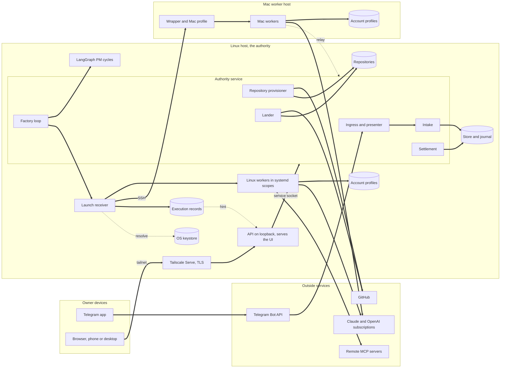

# PLAN-0019: the factory's operating model

**Status.** Draft for the owner's approval, 2026-09-25, written against origin/main `c1fd591` and the
branches named below. This document designs the owner's operating requirements of 2026-09-25 (his
Telegram messages that day, including 29122, 29126, 29127 and 29128) on top of what PLAN-0019
revision 3 and its controlling design (R01 to R76) already built or specified. It changes no code. Once
approved, it governs the nine areas below; where it and the controlling design disagree on those areas,
this document wins, and PLAN-0019 revision 4 records the change in its constraint C1.

**How it is organized.** One section for each requirement area, each in the same six parts: (a) the
requirement in one or two sentences, (b) what already exists and is reused, (c) the gap, (d) the design,
(e) the changes it implies, mapped to specifications, and (f) what is deliberately not built now. Then
one end-to-end walkthrough, the MVP critical path and the risks. Every new component is tied to a
requirement; everything else is reuse.

**Three decisions run through the whole design.** First, every model invocation in the factory is an
ordinary dispatched worker run: the project manager's reasoning, requirements elaboration, building and
review all go through the same Runner (VELDO-0039), so all of them use the account pool, obey the usage
caps, run contained and appear in the live terminal view. Second, a worker never acts outside its
isolated clone: creating a repository, pushing, and storing a credential are trusted effects performed
by the authority service on the owner's settled answer, which is how "an agent creates the repo" works
without handing a model push credentials. Third, the factory is one coordination domain holding every
repository of both of the owner's Git identities; identities are kept apart per repository by
construction (VELDO-0142), not by running two factories.

## 1. The shape of the factory

The factory runs on this Linux host, with one Mac worker host for macOS and iOS work, and is used from
the owner's phone and desktop over his tailnet. The table lists every component the MVP needs, where it
runs, and whether it exists.

| Component | Runs on | What it does | State |
|-|-|-|-|
| Authority service | Linux, systemd user unit | Store and journal, command socket, the one scheduling instance | Built: VELDO-0047, VELDO-0139 |
| Telegram ingress and presenter | Inside the authority service | Acquires messages, sends presentations and reports | Built: VELDO-0073, VELDO-0138; reports VELDO-0128 unbuilt |
| Intake | Inside the authority service | One normalized command for every channel | Built: VELDO-0126 |
| Settlement and decision binding | Inside the authority service | Each answer settles once, from any channel | Built: VELDO-0068, VELDO-0069; standing delegation VELDO-0140 ready |
| Factory loop | Inside the authority service | Woken by each commit: starts due PM cycles, dispatches eligible units | New criterion: VELDO-0129 AC4, with VELDO-0088 AC3 |
| PM cycle runner | Linux, isolated LangGraph runtime | Executes the bound workflow revision one judged step at a time | Built: VELDO-0132, VELDO-0043, VELDO-0045; PM graphs VELDO-0088 unbuilt |
| Runner and launch receiver | Linux | Prepares a dispatch, picks the account, spawns the contained worker, reaps it | Built: VELDO-0039 to VELDO-0042; account choice VELDO-0062 |
| Execution record | Linux files written by the receiver | Every event, output line and error of every run, redacted, in order | Draft: VELDO-0141 |
| Capability handoff | Inside the receiver and engine adapters | Generates each run's exact MCP, tool, skill and instruction configuration | VELDO-0127, VELDO-0060, VELDO-0061 unbuilt |
| MCP catalog and credential store | Store records; OS keystore on Linux | Server definitions once; secrets by reference only | New: VELDO-0144 |
| Repository provisioner | Trusted effect in the authority service | Creates or adopts a repository under one Git identity | New: VELDO-0143, VELDO-0142 |
| Lander | Linux | Publishes exactly the tested tree, with the repository's identity | Built: VELDO-0056 to VELDO-0058; identity VELDO-0142 |
| API | Linux loopback behind Tailscale Serve | Reads, messages, answers, configuration, live streams; serves the UI | Built: VELDO-0130; new route families come with their owning specs |
| UI | Owner's browser on phone and desktop | Every screen of the journey, including the live terminal | Unbuilt: VELDO-0131 |
| Mac worker host | Mac, reached over SSH | Trusted wrapper, Mac profile, clones, account profiles; commands back through the relay | Unbuilt: VELDO-0124, VELDO-0125; relay VELDO-0108 built |



## 2. Work starts from a message on any channel

**(a) Requirement.** Work starts from a message on any channel, Telegram now and others later. The
message either describes the work or points at something elsewhere (a Jira ticket, a Confluence page,
an API); agents fetch the referenced material themselves with their local access and MCP servers, and
neither the channel nor the referenced system changes how the factory works.

**(b) What exists and is reused.** VELDO-0126 (landed) turns a Telegram message or an authenticated API
call into one normalized intake command that keeps the source identity, the exact text, the
authenticated principal and the project context, and produces a proposed objective, or an inbox
proposal plus a question when the project is unresolved. It requires no ticket identifier, never admits
or prioritizes, and follows a reply to an earlier message onto the live objective. VELDO-0066 binds the
platform message id, sender and time; VELDO-0067 gives each channel edge its own signing key;
VELDO-0073 and VELDO-0138 activate and run the Telegram ingress inside the service; the UI message box
is VELDO-0130's message route into the same intake. Constraint C7 already rules out watchers, polling
and webhooks.

**(c) Gap.** Three things are missing. When a message points at a ticket, nothing records what the
agent actually read, so if the ticket is edited after the fetch the requirement drifts silently and the
reviewer has nothing fixed to judge against. Nothing says what happens when no configured tool can reach
the referenced system. And "any channel" has no written adapter contract, so a third channel would be
designed from scratch.

**(d) Design.** A **channel adapter** is five operations against modules that already exist: acquire a
message from the platform, attribute it (VELDO-0066), sign it at its own edge (VELDO-0067), submit it to
intake (VELDO-0126), and present requests and reports back (VELDO-0065). Adding a channel means
implementing those five and enrolling its edge; intake, settlement and everything downstream do not
change.

| Operation | Telegram today | What a later channel supplies |
|-|-|-|
| Acquire | The Bot API's getUpdates exchange in the ingress | Its platform's delivery |
| Attribute | Platform message id, sender id, platform time | The same three facts from its platform |
| Sign | Telegram edge key | Its own edge key |
| Submit | Intake source kind `telegram` | A new source kind |
| Present and report | Presenter with reply threading | Its own rendering of the same presentation |

**Referenced material** is fetched by the elaboration step, which is a worker run with the elaboration
role's configuration (section 4). For each item the message points at, the run fetches it with its
configured tools and publishes a **source material record** beside the requirements it writes, through
the same publication path as specifications (VELDO-0085 with VELDO-0037 allocation). The record holds
the reference as the owner wrote it, the tool and server used, the fetch time, the content digest and
the fetched content itself as a published artifact. Requirements and specifications cite the record, so
review judges the change against what was fetched. A later edit to the ticket is new input only when the
owner sends a message about it. When no tool in the role's configuration reaches the reference, the
cycle asks the owner through an ordinary decision request that names the reference and the missing
capability; nothing guesses and nothing proceeds on the plain text alone.

**Data and placement.** The source material record is a published artifact with fields reference,
server and tool, fetched at, content digest, content path, objective and elaboration run. The fetch runs
inside the worker run, on whichever host the elaboration role is placed; the record is committed on
Linux.

**(e) Changes.** Amend VELDO-0091 AC1: its published outputs include one source material record for
every external reference in the objective's messages, and a reference no configured tool reaches becomes
an owner question. No new specification.

**(f) Not built now.** Channels other than Telegram and the API (a Release 4 choice), any watcher,
webhook or polling of the referenced systems, a factory-side fetcher, and automatic re-fetch when a
ticket changes.

## 3. MCP servers are configured in the UI, credentials live in the OS keystore

**(a) Requirement.** MCP servers are defined in the UI and saved. Their credentials live in the local
OS keystore, and a cloud keystore replaces it later if the factory runs in the cloud.

**(b) What exists and is reused.** VELDO-0127 (ready, unbuilt) specifies versioned per-role
configuration with MCP server identities, commands, arguments, settings and protected credential
references, and an exact handoff that neither drops nor adds a capability. `.veldo/secretref.py`
(PLAN-0013) is the reference seam: a secret is named by a reference such as `keychain:<name>`, resolved
only at the moment of use into a handle that never prints its value; it has schemes env, keychain, file,
vault and ssm but only a test store behind them. `.veldo/secret_scan.py` detects credential shapes and
high-entropy strings. VELDO-0130 has a configuration route family (workflow revisions so far), passkey
sessions, and redaction by field name and by the secret scanner; its build history names agent
configuration edits as a gap no typed command fills.

**(c) Gap.** There is no catalog: VELDO-0127 embeds each server's definition inside every role that uses
it, so one server and its credential would be defined as many times as roles use it. No real keystore
adapter exists. No path takes a secret from the UI to a keystore, and no route or typed command edits
servers or credentials.

**(d) Design.** Definition is split from selection. The **MCP server catalog** is a record family in
the store, versioned the way VELDO-0132 versions workflows: every save is a new immutable revision and
earlier revisions are kept. Roles select servers from it by id and revision (section 6).

| Field of `mcp_server` | Meaning |
|-|-|
| id, revision, label | Identity and version; a save never overwrites |
| transport | `stdio`, `http`, or `account_connector` |
| command and arguments | For stdio servers |
| url | For http servers |
| environment | Name to value, where a value is a literal or a credential reference |
| headers | For http servers, name to credential reference |
| hosts | Hosts the server can run on (Linux, Mac) |
| identity tag | Optional Git identity the credential belongs to (section 5) |

A **credential** has two halves. The value lives only in the OS keystore of the authority host. The
store keeps a `credential` record with id, label, reference, optional identity tag, set at and set by,
and nothing else; the catalog refers to it by reference. On Linux the keystore is the Secret Service
provided by the GNOME keyring daemon already running in the owner's session, reached through the
`secret-tool` executable from the distribution's libsecret-tools package (version 0.21.4 in this
release's archive, not yet installed; GNOME's libsecret, LGPL-2.1+ with GPL-2+ parts, run as a separate
process and never linked). This realizes secretref's keychain scheme; a cloud factory later resolves the
same references through the vault or ssm scheme with nothing else changed.

**Saving a credential.** The UI's server form has write-only credential fields. The value travels once,
over TLS from Tailscale Serve and inside the owner's passkey session, to the API's credential route. The
API process runs on the same host as the same account; it writes the value to the keystore itself, then
asks the authority to commit the credential record, which carries the reference and metadata only. The
value never enters the store, the journal, the event feed, proof, logs or any command line. The UI can
replace or delete a value but never read one back.

**Delivering it to a run.** Immediately before a spawn, the launch receiver resolves the references the
dispatch's configuration uses and writes the engine's generated MCP configuration, values included, into
the run's private directory: mode 0700, under the factory state root, outside the clone, removed when
the run is reaped. For a Mac run the resolved values travel inside the launch packet over the same SSH
channel as the contract, and the Mac wrapper writes the same private file there; nothing is written to
the Mac's keychain. A locked or unreachable keystore, or a reference that does not resolve, refuses the
launch by name (`credential_unavailable:<id>`); the run never starts without the server.

**Account connectors.** Some servers come with a logged-in Claude account rather than a configuration:
the claude.ai connectors, which is how the owner reaches Atlassian today. They are catalog entries of
transport `account_connector` with no credential. A role that selects one runs only on an account that
has it (the account record lists the connectors seen at registration, section 8), and the adapter turns
account connectors on only when selected; the installed Claude Code has both an environment switch and
a setting for this. Codex cannot use them, so a role selecting one is Claude-only.

**The honest boundary.** In the MVP a worker's own tool commands run as the same OS user as its MCP
servers, so a worker could read a credential its own servers use, exactly as an interactive session can
today. Provider model credentials stay separated under VELDO-0062 AC1. Running MCP servers under a
separate OS user per run is later work.

**(e) Changes.** New **VELDO-0144**: *MCP servers are defined once through the UI as versioned records,
and their credentials are written to and read from the host OS keystore only.* Its criteria cover
versioned catalog saves through a typed API route, the keystore write and resolve path with no value in
store, journal, proof, logs or command lines, and the named refusal when the keystore is locked or a
reference is missing. Amend VELDO-0127 AC1 so server definitions are catalog references rather than
embedded copies. VELDO-0131 gains the "MCP servers and credentials" screen row.

**(f) Not built now.** A cloud keystore, per-run OS users, credential rotation reminders, storing MCP
credentials in the Mac keychain, and a connection test button.

## 4. A project manager coordinates each piece of work and decides who is needed

**(a) Requirement.** Each piece of work has a project manager that coordinates it and decides which
specialists it needs.

**(b) What exists and is reused.** VELDO-0132 (landed) stores workflows as versioned data, binds each
LangGraph cycle to one exact revision, and judges every step through ordinary proposals and eligibility,
with step kinds budget, subject, owner wait, assignment and result. VELDO-0043 and VELDO-0045 run
LangGraph behind a replaceable plain-data adapter in an isolated runtime. VELDO-0089 (landing on
`build-veldo-0089`) stores a project's team as versioned data with four required roles (project
manager, elaboration, implementation, independent review), each with workers, responsibilities,
expertise, proposal permissions, engines, budget and independence, and assigns a builder and
independent reviewers under the repository's review policy. VELDO-0088 (PM graphs), VELDO-0090
(selection), VELDO-0091 (elaboration), VELDO-0078 (backlog), VELDO-0079 (grooming) and VELDO-0085
(decomposition) are ready and unbuilt.

**(c) Gap.** The team schema is closed to the four role names, so a project manager cannot choose a
designer for one piece of work and an iOS builder for another. Nothing says how a model-mediated step
runs: which account, which configuration, whether the owner can watch it. There is no default pipeline
for a new project to use. Nothing in the running service starts a cycle or a dispatch. And with
VELDO-0092 moving to Release 2, the path by which a PM's proposals take effect must be stated.

**(d) Design.** **The PM is a role whose reasoning runs as ordinary worker runs.** At a coordinate node
of the bound workflow, the cycle runner dispatches a PM run through the Runner (VELDO-0039), under a
coordination station whose subject is the project's objective or inbox proposal, with the role's
capability configuration and the cycle's accepted snapshot as input. The run returns one typed proposal
document: questions for the owner, decomposition, and a staffing choice for each unit (the role, and the
optional capabilities that work needs, section 6). Elaboration is the same, with the elaboration role.
So the PM's thinking is visible in the live terminal like any build.

**Proposals take effect through their owners.** The cycle checks the document's structure and hands
each proposal, in order, to the command that owns it: VELDO-0064 for a decision request, VELDO-0079 for
grooming, VELDO-0085 for publication, VELDO-0089 for an assignment. Each of those commands already
checks its own authority, versions and scope. A refusal stops the rest of that cycle's proposals by name
and is reported to the owner; the next cycle starts from the new accepted snapshot. All-or-nothing
groups and the complete two-way proposal registry are VELDO-0092, in Release 2.

**Specialists.** The team may name roles beyond the four required ones, such as `designer`,
`ios_builder` or `researcher`. Each has the same fields plus a reference to its capability
configuration (VELDO-0127) and a kind, required or specialist. The PM's staffing choice names roles;
VELDO-0090 checks expertise, engine, host capability and independence, and a missing specialist becomes
a staffing request to the owner, never an invented worker.

**The default pipeline.** The factory ships one workflow revision that every piece of work runs, from a
one-line fix to a design document: "implementation" means whatever the work's artifact is (code, a
design, a research note), and it is always committed to the project's repository, so proof, gate,
review and landing apply the same way.

| Station | What happens | Owner |
|-|-|-|
| Intake | Message kept, proposal made | VELDO-0126 |
| Coordinate | PM run plans the work | VELDO-0088 |
| Elaborate | Requirements, source records, specifications with their reviewer section | VELDO-0091, VELDO-0085 |
| Admit | Owner accepts the objective, admits and prioritizes | VELDO-0077, VELDO-0079, VELDO-0078 |
| Assign | PM staffs builder and reviewers | VELDO-0090, VELDO-0089 |
| Build | Specialist run in an isolated clone | VELDO-0129, VELDO-0060, VELDO-0061 |
| Prove and gate | Proof kept, gate run outside the candidate | VELDO-0050, VELDO-0058 |
| Review | Fresh independent reviewer | VELDO-0129 AC2 |
| Land | Exact tested tree published | VELDO-0056, VELDO-0057 |
| Report | Telegram and UI | VELDO-0128, VELDO-0131 |

**The factory loop.** The authority service is already the one scheduling instance (VELDO-0047). After
every commit it receives the post-commit hint it already sends to the API (VELDO-0046, VELDO-0130). On
that hint it starts a PM cycle for any project with new relevant input, one cycle per project with one
bounded follow-up (VELDO-0088 AC3), and offers each assigned, eligible unit to the Runner with a selected
host and account (VELDO-0129 AC4, section 8). A unit waiting for an account's reset is woken by a timer
set to that reset time. Nothing polls.

**Data and placement.** Team role fields gain `capability_configuration` and `kind`; an assignment
gains `optional_capabilities`. The loop and the cycle runner run on Linux; PM and elaboration runs go to
whichever host their role allows.

**(e) Changes.** Amend VELDO-0089 AC1 to allow specialist roles beyond the required four, each with a
capability configuration reference. Amend VELDO-0088 AC1 so its cycles run the default pipeline and its
model-mediated nodes launch through the Runner, and its Notes so the authority service runs the cycle
scheduler on the post-commit hint. Add VELDO-0129 AC4: *the running authority service's factory loop,
woken by each commit hint and by account reset timers, offers every assigned eligible unit to the Runner
and stops offering a paused project's units; nothing polls.* Amend VELDO-0090 AC1's set to include the
optional capabilities a staffing choice requests, which must lie within the role's configuration. The
plan moves VELDO-0092 to Release 2.

**(f) Not built now.** Atomic proposal groups (VELDO-0092), persistent PM checkpoints, more than one
concurrent cycle per project, a PM that edits its own team or workflow, and automatic defect
reproduction (VELDO-0080, Release 2).

## 5. New projects in new repositories, from chat, with identities that never mix

**(a) Requirement.** The owner often starts a new project in a new directory that becomes a new Git
repository, under the Bcengi organization or his personal account. He asks in chat, the factory
creates the folder and the repository, and adopts it as the project's repository with no separate
command; a UI form can come later. Personal and Bcengi identities never mix.

**(b) What exists and is reused.** VELDO-0029's signed enrollment binding decides which authority a
clone writes to. The store already binds many repository ids per domain (`repository_bindings`), and
VELDO-0047's installer accepts several workspaces with one receiver configuration each, at installation
time. VELDO-0076 binds a project to one execution repository and activates it by the owner's signed
command. VELDO-0028 executes protected effects. `init_scaffold.py` lays Veldo into a repository.
VELDO-0139 set the owner up as the host's enrollment signer. The lander (VELDO-0057) pushes with
whatever Git credentials the host environment holds.

**(c) Gap.** Nothing creates a repository as an effect, and a running service cannot take on a new
repository without reinstallation. VELDO-0076 accepts only "this store's one repository" and only the
owner's own key, which he does not have in a chat. And there is no identity model at all: commit author,
remote owner and push credential are ambient, so a personal project could be authored with a bcengi.com
address or pushed with Bcengi credentials, and nothing would notice.

**(d) Design.** **A Git identity** is configured once, at setup or in the UI.

| Field of `git_identity` | Meaning |
|-|-|
| id, label | For example `bcengi` and `personal` |
| author name and email | Written into every clone of its repositories |
| remote host and owner | The GitHub organization or user new repositories are created under |
| allowed remote owners | The only owners a repository of this identity may point at |
| push credential | A keystore reference to a token, or a path reference to an SSH key |
| projects root | Where new directories are made; both identities may share one directory |
| default visibility | Private unless the owner says otherwise |

**The binding rule.** Every repository record names exactly one identity, set when it is created or
adopted and never changed. Every Git operation the factory performs on that repository takes its values
from that identity alone: the author configuration of each worker clone, the lander's push, the remote's
creation. The factory strips ambient Git and SSH agent overrides by prefix and ignores global and system
Git configuration for these operations, so no environment value can substitute another identity. A
remote whose owner is not in the identity's allowed owners refuses. A credential tagged with an identity
(section 3) can be selected only for work on that identity's repositories, and a unit of one identity
cannot attach a repository of the other (the C13 attachments). The identity is always recorded, never
inferred from a path or a remote.

| Field of `repository` | Meaning |
|-|-|
| repository uuid, name | Identity in the domain |
| identity | Exactly one `git_identity` |
| path | Its location on the Linux host |
| remote | URL, owner, default branch |
| origin | `created` or `adopted` |
| enrollment | Digest of its VELDO-0029 binding |
| state | `provisioning`, `active` or `failed` with a named reason |

**Creating one from chat.** The owner writes, for example, "start a new personal project called
tidepool". Intake cannot place it in a project, so it becomes an inbox proposal (VELDO-0126). The
factory PM, which is the PM role of the factory's default team template, prepares a project proposal
from his words: the project name, the identity (asked if he did not say), the directory under that
identity's projects root, the remote name and visibility, the first objective, the default team and
pipeline, and the default coordination budget. It is presented as one decision request in Telegram and
the UI. His one answer, a yes or a correction, is the only question, and it is the objective acceptance
he would have been asked for anyway. On the settlement, the repository provisioner, a registered
protected effect (VELDO-0028) in the authority service, runs these steps in order, each recorded, and
stops by name at the first failure.

1. Refuse if the directory exists and is not empty; if it is already a Git repository, take the adoption
   path instead.
2. Create the directory, initialize the repository, lay down Veldo with the scaffold, write the
   identity's author configuration, and make the initial commit.
3. Create the remote under the identity's owner through GitHub's REST interface with the identity's
   token, using the standard library, then push the initial commit with the identity's credential.
4. Adopt it (below), then activate the project (VELDO-0076) from the same settlement, binding this
   repository, the default team template (VELDO-0089) and the default pipeline (VELDO-0132).

**Adoption** also serves an existing repository the owner names. The provisioner checks its remote owner
against the chosen identity, then an **adoption signer** signs its VELDO-0029 binding. That signer is a
service key setup enrolls among the host's enrollment signers, kept in the protected key directory,
whose only use is signing a binding for a repository named in a settled owner decision; the effect
executor checks the settlement before asking for the signature. The store binds the repository's id to
its path, the running service adds that repository's receiver configuration and serves it without a
restart, and the record becomes `active`.

From the owner's side this is what Claude Code does today: he asks, and the folder and repository exist.
The difference is who does it. A worker is confined to its isolated clone and never holds push
credentials (R45), so the creation is the authority's trusted effect on his answer, and the first
content he asked for (README, layout, first code) is the project's first ordinary unit, built, reviewed
and landed like any other.

```mermaid
sequenceDiagram
  participant O as Owner (Telegram or UI)
  participant I as Intake
  participant P as Factory PM run
  participant S as Settlement
  participant R as Repository provisioner
  participant G as GitHub
  participant A as Authority service
  O->>I: "start a new personal project called tidepool"
  I->>P: inbox proposal, cycle started
  P->>O: one proposal: name, identity, directory, remote, first objective
  O->>S: "yes"
  S->>R: settled decision
  R->>R: directory, init, scaffold, identity author, first commit
  R->>G: create remote under the identity, push
  R->>A: adoption: signed binding, repository bound, served without restart
  A->>A: project activated with default team and pipeline
  A->>O: "tidepool is ready; the first objective is next"
```

**Placement.** The provisioner, the lander and every repository live on Linux; a Mac run receives a
clone of the repository at its accepted commit for each dispatch (VELDO-0124, VELDO-0125).

**(e) Changes.** New **VELDO-0142**: *Every repository is bound to exactly one Git identity, and every
author, remote, push credential and attachment used for it comes from that identity alone.* Its criteria
cover worker clone authorship and lander pushes from the identity with ambient overrides stripped, the
remote-owner refusal at adoption and push, and the refusal of a cross-identity credential or attachment.
New **VELDO-0143**: *A repository the owner asks for in chat is created under his named identity, adopted
by the running factory without a restart and bound to a new project, on his one answer.* Its criteria
cover creation from a settled answer (and never from intake alone), adoption into the running service
without reinstallation, and project activation with the default team and pipeline. Amend VELDO-0076
AC1: the execution repository is any repository adopted in this domain, and activation may be applied
from the owner's settled answer to a presented activation, the way VELDO-0089 applies a team amendment.
VELDO-0131 gains a read-only "Repositories and identities" screen row.

**(f) Not built now.** The optional UI form, Git hosts other than GitHub, deleting or archiving a
repository, moving a repository between identities (refused), and several projects in one repository.

## 6. Tight per-work control of MCP servers, tools, skills and instruction files

**(a) Requirement.** Each piece of work gets exactly the MCP servers, tools and skills it needs, because
server definitions loaded when they are not needed waste tokens. Instruction files such as CLAUDE.md
waste context too: each role's configuration lists the instruction files it loads, and none load by
default.

**(b) What exists and is reused.** VELDO-0127 specifies exact handoff of native tools and MCP selections
for both engines, a named stop for an unsupported handoff, and a dispatch that records the configuration
revision it used. C15 forbids the factory silently reducing or adding capabilities. The receiver already
launches exactly the recorded configuration. Both installed engines have the levers this needs, found
today in their help output and binaries (Claude Code 2.1.281, Codex 0.154.0), listed in the table below.
Claude Code's bare mode is not usable: it refuses subscription logins, which would force a paid API.

**(c) Gap.** VELDO-0127 has no skills and no instruction files. Everything a role lists always loads, so
there is no per-work choice short of defining a new role. Nothing states that instruction files are off
by default, and nothing turns off what each account's own profile would add (its user settings, its own
CLAUDE.md, its skills), which would also make runs differ by account.

**(d) Design.** **Nothing loads unless the role lists it, and each listed item has a load mode.** Every
item in a capability configuration (an MCP server selection, a skill, an instruction file) is either
`always` or `when assigned`. The PM's staffing choice names the `when assigned` items a piece of work
needs, for example the Atlassian server because the request points at a Jira ticket; VELDO-0090 checks
they belong to the role; the assignment records them; the dispatch records the configuration revision
plus the chosen items. The factory never adds an item beyond the configuration and never drops an
`always` item or an assigned one, so C15 holds and "per work" is a recorded choice rather than a silent
reduction.

| Field of `capability_configuration` | Meaning |
|-|-|
| role, revision, engine | What it configures; saves never overwrite |
| native tools | The engine's built-in tools, as listed |
| MCP selections | Catalog server and revision, all tools or a list, load mode |
| skills | Skill catalog id and revision, load mode |
| instruction files | Source (the project repository or the factory), path, load mode |
| engine settings | Model and other engine options, as today |

**Skills** are registered once in a small catalog (id, source directory, digest). **Instruction files**
are named by path. For every run the adapter turns off the engine's own discovery of instruction files
and skills and the account profile's settings, and hands in exactly the listed and assigned items. Each
account profile then supplies only the login, so the same role behaves the same on every account.

| Capability | Claude Code 2.1.281 | Codex 0.154.0 |
|-|-|-|
| Account login | `CLAUDE_CONFIG_DIR` per account profile | `CODEX_HOME` per account profile |
| Profile settings off | Setting sources restricted, one generated settings file | The ignore-user-config option (login still read from `CODEX_HOME`), generated configuration |
| MCP servers | The strict MCP option with a generated MCP configuration file | Generated `mcp_servers` configuration |
| Account connectors | `ENABLE_CLAUDEAI_MCP_SERVERS` or the matching setting | Not available |
| Native tools | The tools list and allowed and disallowed tool lists | Sandbox mode and feature configuration |
| Skills | The `skillOverrides` setting, a generated plugin directory, the option that disables all skills when none are listed | The skills configuration |
| Instruction files | `CLAUDE_CODE_DISABLE_CLAUDE_MDS`, the listed files through an appended system prompt file | `project_doc_max_bytes` at zero, the listed files through developer instructions |
| Structured stream | Print mode with stream JSON output | Exec with JSON events |

These names come from the installed tools, several of them internal settings rather than documented
contracts, so none is relied on until qualification proves its effect on the pinned version, and a new
engine version is requalified before use (VELDO-0060 AC1 already refuses a changed executable digest).

**Proof of the handoff.** At session start each engine reports what it loaded; Claude Code's stream
begins with an initialization event listing its tools, MCP servers, user-invocable skills, plugins
and loaded memory file paths. The receiver compares that
inventory with the recorded set in both directions and stops the run by name on any difference
(VELDO-0127 AC2). Where an engine reports less, the adapter compares its generated configuration and the
engine's own MCP listing instead. The first turn's reported context size is kept in the execution record,
so the owner can see what a configuration costs before any optimization is designed around it.

**(e) Changes.** Amend VELDO-0127 AC1: the schema gains skills, instruction files and load modes, and
refers to catalog servers (section 3). Add **VELDO-0127 AC4**: *instruction files and skills load only
when the role lists them; a `when assigned` item loads only when the assignment names it; the engine's
reported inventory at launch equals the role's `always` items plus the assigned ones.* Amend VELDO-0060
AC1 and VELDO-0061 AC1 so their qualification set includes every handoff lever in the table on the
installed version. VELDO-0090's amendment is in section 4.

**(f) Not built now.** Choosing capabilities automatically by token cost, per-tool usage analytics,
managing or deduplicating instruction file content, and loading a capability part way through a run.

## 7. The full pipeline, feedback everywhere, and the live terminal

**(a) Requirement.** Every task runs the full pipeline. Feedback reaches the owner in Telegram and in
the UI, and the UI shows each worker run's full live execution detail the way the Claude Code or Codex
terminal does: every tool call, command, edit, output and error, never only a summary. Without it he
cannot stop using the terminal.

**(b) What exists and is reused.** The floor (VELDO-0049 to VELDO-0058) keeps proof, runs the gate
outside the candidate, requires fresh review and lands the exact tested tree. VELDO-0130 serves a live
event stream with cursors and reconnect, redacts with the secret scanner, and receives one-shot hints on
its own socket from the service. VELDO-0141 (draft on `spec-veldo-0141`) specifies the execution record.
The launch receiver (`.veldo/control_launch.py`) reads every chunk a worker writes to its output, but
only to hash and count it, and sends the error stream to nowhere; a Mac run's output arrives through the
same receiver over SSH. VELDO-0128 (Telegram reports) is ready and unbuilt.

**(c) Gap.** Nothing of a run is kept, no route serves it, and the UI contract's run screen is a step
timeline, a summary. Telegram reports are unbuilt.

**(d) Design.** **The execution record** is one append-only file per dispatch on the Linux host, under
the factory state root, mode 0600, written only by the launch receiver.

| Field of each record line | Meaning |
|-|-|
| sequence | Gapless, per dispatch |
| received at | Receiver time |
| stream | `engine` (a structured event), `stderr` (a raw line) or `wrapper` |
| redacted | Whether the scanner replaced anything, and which kinds |
| payload | The engine's own event unchanged, or the raw line |

**Capture.** The adapters launch both engines in their structured streaming modes (table in section 6).
The receiver's existing reap loop, which already wakes for every output chunk, also reads a second pipe
for the error stream, splits both into lines, redacts each line with the secret scanner (known patterns
and entropy, replacing only the matched span with a marker naming its kind), appends it, and after each
batch sends a one-shot hint with the dispatch and last sequence to the API's hint socket. A Mac run's
output and error streams arrive separately over SSH into the same receiver, so every record is written
on Linux. When the run ends, its termination record commits the line count, byte count and digest of
the record, which binds the record to the run as evidence.

**Serving and the terminal view.** The API's run record route returns the lines after a cursor and
streams new ones live over the existing event-stream mechanism, only to a member whose scope covers the
run's project, and never a line that has not passed redaction. The UI's run screen is a terminal: every
event in order, tool calls with their inputs and results, command output in monospace, edits as diffs in
Monaco, errors marked, a follow mode, search, on phone and desktop. It is reached from the unit, the run
and the worker screens, beside a pipeline strip showing which station the unit is at.

**Feedback.** Questions and decisions already reach both channels and settle once (VELDO-0065,
VELDO-0068). VELDO-0128 sends progress, stops and completion to Telegram from journal events, in plain
words naming the unit; the full detail is in the UI's run screen.

**(e) Changes.** Move VELDO-0141 to ready with three amendments: `depends_on` adds VELDO-0060 and
VELDO-0061, since AC1 needs real engines; AC1's set adds a Mac run through the relay; its Notes name the
hint to the API and the digest committed at termination. Its AC3 already replaces VELDO-0131's "Live
agent run" row with the live terminal. Bring VELDO-0141 into PLAN-0019 Release 1 as a work item.

**(f) Not built now.** Replay or editing of a record, retention and archival (Release 2; the first live
runs measure the size of a record before any limit is designed), typing into a running worker, a view of
runs outside the factory, and search across all runs.

## 8. All logged-in accounts, balanced, added without stopping

**(a) Requirement.** Workers use all of the owner's logged-in subscription accounts (three Claude Code
and one Codex today, more later) with no manual logins beyond the first. Usage is monitored, work is
balanced across accounts, work moves off an account at its limit, and accounts are added without
stopping anything. Only logged-in subscriptions; paid model APIs are prohibited.

**(b) What exists and is reused.** `.veldo/accounts.py` registers Claude Code logins, one
`CLAUDE_CONFIG_DIR` profile each, and prints the one-time login step; its registry is a JSON file under
one repository's Git common directory. `.veldo/fleet.py` is the older loop that ran one worker per
account under the token governor. VELDO-0036 (built) reserves capacity and usage per account, project
and unit. VELDO-0062, widened today on `spec-veldo-0062-widen` (Telegram 29127, 29128), adds AC5: any
number of accounts per provider, run concurrently, each with its own profile, usage and rate-limit
windows, new work moved off an exhausted account, and an account added without restarting anything.
Both installed engines carry subscription rate-limit fields, found in their binaries today and to be
confirmed in their streams by qualification: Claude Code a rate-limit event with five-hour and seven-day
utilization and reset times, Codex rate limits with used percentage, window length and reset time.

**(c) Gap.** The registry covers Claude only, lives with one repository, and cannot be read by the API
or joined to the usage ledger. One account needs a separate login on each host, which the registry
cannot express. There is no selection rule, nothing moves a run already in progress when its account hits
the limit, and a new account has no usage observation to judge it by.

**(d) Design.** **An account is a store record** at factory scope, and `accounts.py` becomes the local
helper that prepares a profile directory and prints its login step for either provider.

| Field of `account` | Meaning |
|-|-|
| id, provider, label | `claude_code` or `codex` |
| status | `active`, `paused` by the owner, or `disabled` |
| profiles | Per host: the profile directory (`CLAUDE_CONFIG_DIR` or `CODEX_HOME`) |
| connectors | Account connectors seen at registration |
| windows | Per window: utilization, reset time, observed at, source dispatch |
| concurrency | Runs allowed at once; one by default |

**Adding an account.** The owner registers it for a provider and host, logs in once into the prepared
profile, and a short qualification run confirms the login and reads its connectors. The Runner reads
the pool at every dispatch, so the new account takes work at the next dispatch with nothing restarted.
The Mac needs its own one-time login into each account it will use.

**Choosing an account** is part of preparing a dispatch, inside the VELDO-0036 reservation. The
candidates are the active accounts of an engine the role allows, with a profile on the chosen host,
outside every reported rate-limit window, under their concurrency, and holding any account connector the
configuration selected. The Runner picks the one with the lowest last reported utilization on its
tightest window, then the fewest active runs, then the least recently used, and reserves on it. With no
candidate the unit waits, the UI shows "no account until" the earliest reset, and the factory loop sets
a timer for that time.

**At the limit.** When a run's stream reports its account's window exhausted, or the engine ends with
its rate-limit result, the receiver records the window and its reset time and the run ends with the
known outcome `account_limit`. Its effects were confined to its isolated clone and it produced no
result, so the factory loop dispatches the same station again, under a new dispatch identity, on another
account, from the same accepted commit. The lost partial work is bounded by one run.

**A new account** has no observation yet, so until its first one it admits one run at a time, which
bounds its unknown usage to one invocation, as VELDO-0062 requires ("unknown is never zero").

**Monitoring.** The UI's usage screen shows each account's windows over time, its active runs and its
reset times. Telegram tells the owner only when every account of a provider is at its limit, because
that is the case that stops work.

**(e) Changes.** Amend VELDO-0062 AC5: a run stopped by its account's limit is dispatched again on
another account from its accepted commit, and an account with no observation admits one run at a time.
Amend its Notes: the registry is a store record family with per-host profiles for both providers, and
the selection order above. VELDO-0131's usage screen row adds the per-account breakdown.

**(f) Not built now.** Carrying a session over to another account mid-run, automatic login, predictive
pacing, cost optimization across providers, and sharing accounts between factories.

## 9. Long-lived agents (named, not designed)

**(a) Requirement.** Agents will live long, with grown configurations and code, and become more
deterministic and cheaper. This is named, not designed now.

**(b) to (d) Where it will grow.** Three places in this design are where that growth attaches: the
versioned capability configurations, whose revision history is the grown configuration of each role;
the instruction files a role lists, which are where learned lessons (the existing lessons store) would be
distilled; and the workflow's registered step kinds (VELDO-0132), where a deterministic step replaces a
model step once its behavior is proven, which is how agents become cheaper and more predictable. The
account pool's per-role usage history is the measurement that would drive it.

**(e) and (f).** No change and nothing built.

## 10. MVP scope

**(a) Requirement.** Keep the Mac workers (VELDO-0124, VELDO-0125) and VELDO-0085; move only VELDO-0080
and VELDO-0092 to Release 2. A large project starts as soon as the MVP is ready, so use comes first:
no over-architecture and no over-building.

**(b) and (c) What moves.** VELDO-0080's ordinary "fix this bug" path is already the default pipeline
(section 4), so moving it costs nothing the owner uses. VELDO-0092's deferral means proposals take effect
one command at a time with a named stop, instead of all-or-nothing groups (section 4 and the risks).

**(e) Changes.** PLAN-0019 revision 4 moves W65 (VELDO-0080) and W77 (VELDO-0092) to Release 2; adds
Release 1 work items for VELDO-0140, VELDO-0141, VELDO-0142, VELDO-0143 and VELDO-0144; updates
VELDO-0059's `depends_on` (drop VELDO-0080 and VELDO-0092, add the five); names this document in C1
beside the controlling design; and changes RJ1 so the full journey starts from a Telegram message that
points at a Jira ticket, uses at least two accounts and is watched in the live terminal view.

## 11. Walkthrough: a Telegram message pointing at a Jira ticket, to a landed change

1. The owner writes in Telegram, "please do BCG-123". The ingress in the authority service acquires it
   (VELDO-0073, VELDO-0138); attribution binds the platform message id, sender and time (VELDO-0066);
   the Telegram edge signs it (VELDO-0067).
2. Intake turns it into one normalized command and a proposed objective in the project he named or
   replied in, or an inbox proposal and a question (VELDO-0126). The commit's hint wakes the factory loop
   (VELDO-0129 AC4), which starts the project's PM cycle on the default pipeline revision (VELDO-0088,
   VELDO-0132).
3. At the coordinate node the cycle dispatches a PM run: the Runner prepares it (VELDO-0039), picks an
   account and a host (VELDO-0062 AC5, VELDO-0125), and the receiver launches it contained (VELDO-0040)
   with its capability configuration handed over exactly (VELDO-0127, VELDO-0060). Its execution record
   starts streaming to the UI (VELDO-0141, VELDO-0130).
4. The elaboration run fetches BCG-123 through the Atlassian server its role lists, publishes the source
   material record, the requirements and a specification with its reviewer section (VELDO-0091,
   VELDO-0085, VELDO-0037).
5. Grooming presents one request in Telegram and the UI: accept the objective, admit it, set priority
   (VELDO-0077, VELDO-0079, VELDO-0065). He answers in Telegram; the standing delegation signs it
   (VELDO-0140); it settles once and binds (VELDO-0068, VELDO-0069); the backlog item is admitted and
   prioritized (VELDO-0078).
6. The PM's staffing choice names the builder role and the independent reviewer role, with the Jira
   server as a `when assigned` item for the builder; selection checks it and the team assigns both
   (VELDO-0090, VELDO-0089).
7. The factory loop offers the unit. The eligibility gate and claim pass (VELDO-0052, VELDO-0031); the
   Runner picks Claude account 2 on Linux; the receiver provisions an isolated clone at the accepted
   commit with the repository's identity as author (VELDO-0042, VELDO-0142), writes the run's generated
   MCP and instruction configuration with credentials resolved from the keystore (VELDO-0144), and
   launches Claude Code with its heartbeat (VELDO-0041). The owner watches every tool call, command, edit
   and error live on his phone (VELDO-0141, VELDO-0131).
8. Account 2 reports its five-hour window exhausted. The run ends as `account_limit`, and the loop
   dispatches the same station on account 3 from the same commit (VELDO-0062 AC5).
9. The build returns its commit and proof (VELDO-0050). The loop dispatches a fresh reviewer on Codex
   under a different principal and independence group, with no builder context (VELDO-0129 AC2,
   VELDO-0061); its record is live too.
10. On a passing review the lander builds the candidate, runs the gate outside it and publishes exactly
    the tested tree at the expected old tip, pushing with the repository's identity (VELDO-0056,
    VELDO-0058, VELDO-0057, VELDO-0142). Completion is recorded and published as events (VELDO-0051).
11. Telegram tells him it landed (VELDO-0128); the UI shows the unit landed with its proof, review and
    record; the objective's outcome assessment follows (VELDO-0077).

## 12. MVP critical path

Built already and reused as is: the floor, channels, intake, API, workflow storage, LangGraph runtime,
projects and objectives, setup and the service (everything in section 1 marked built). What remains, in
dependency order:

| Order | Specification | Why here |
|-|-|-|
| 1 | VELDO-0089 | Landing now; teams underpin assignment and configuration |
| 2 | VELDO-0140 | Every answer to a revised or re-presented request needs it |
| 3 | VELDO-0062 (widened) | Accounts and caps come before any engine run |
| 4 | VELDO-0060 | Claude Code adapter with the handoff levers |
| 5 | VELDO-0061 | Codex adapter with the handoff levers |
| 6 | VELDO-0141 | The live record, as soon as real engines run |
| 7 | VELDO-0129 with AC4 | Real build and review, and the factory loop |
| 8 | VELDO-0128 | Telegram reports, independent of the engines |
| 9 | VELDO-0124 | Mac worker profile |
| 10 | VELDO-0125 | Mac routing through the relay |
| 11 | VELDO-0144 | MCP catalog and keystore credentials |
| 12 | VELDO-0127 | Capability configuration, with skills and instruction files |
| 13 | VELDO-0090 | Specialist selection |
| 14 | VELDO-0078 | Backlog and priority |
| 15 | VELDO-0079 | Grooming and admission |
| 16 | VELDO-0085 | Decomposition and publication |
| 17 | VELDO-0088 | PM graphs on the default pipeline |
| 18 | VELDO-0091 | Elaboration with source material records |
| 19 | VELDO-0142 | Git identities |
| 20 | VELDO-0143 | New repositories from chat |
| 21 | VELDO-0131 | The UI; its shell, run terminal and decision screens start right after item 6, and it closes when every screen's data exists |
| 22 | VELDO-0059 | The full installed journey |

With at most two builders at once, two lanes run side by side: the engine lane (3, 4, 5, 6, 7, 9, 10)
and the coordination lane (2, 8, 11, 19, then 12 to 16 once VELDO-0089 has landed), joining at 17, 18,
20, 21 and 22. The earliest point at which the owner can watch real factory runs in the UI is when items
3 to 7 and the UI's run screen have landed.

## 13. Risks

**The Mac and several Claude logins.** `accounts.py` itself records that on macOS Claude Code keeps its
login in the Keychain regardless of `CLAUDE_CONFIG_DIR`, and a Keychain is often locked to a session
reached over SSH. Whether several Claude accounts can coexist on the Mac is therefore unknown, and it is
the first thing the Mac qualification (VELDO-0124, VELDO-0060) measures. If they cannot, the Mac runs
Codex and one Claude account until separate macOS users are set up for the others.

**A locked keystore.** The Linux Secret Service unlocks at the owner's graphical login. After a reboot
with nobody logged in, launches that need credentials stop by name until he logs in; runs that need no
credential continue. Headless unlocking, or systemd's encrypted service credentials (per-user support
needs a newer systemd than this host's 255), are later choices.

**Engine levers are internal.** Several handoff levers are internal settings found in the installed
binaries rather than documented contracts, and may change between versions. Pinned executable digests
and requalification on every engine update contain this.

**Credentials inside a run.** In the MVP a worker's tools can read the credentials its own MCP servers
use (section 3). Output redaction limits what reaches the record, but the boundary is the same as an
interactive session today, and it is stated rather than implied.

**The adoption signer widens enrollment.** A service key that can sign enrollment bindings is new
authority. It signs only for a repository named in a settled owner decision, and every signature is
journaled; the VELDO-0143 review should judge exactly that.

**Restarting at an account limit wastes one run.** A run moved off an exhausted account starts again from
its accepted commit. Carrying a session across accounts would save it and is deliberately later.

**Proposals without atomic groups.** With VELDO-0092 deferred, a cycle's proposals apply one at a time;
a refusal midway leaves the earlier ones applied and stops the rest by name, visibly, until the next
cycle. Nothing half-applied is hidden, but the owner may see a partly groomed item.

**Unmeasured quantities.** The size of an execution record, the right concurrency per account, and the
exact shape of each engine's rate-limit reports are measured on the first live runs; the defaults above
(one run per account, one run at a time before a first observation) are conservative until then.

**Length of the path.** Twenty-two items remain. The largest are VELDO-0088, VELDO-0091 and VELDO-0131;
the order puts the owner-visible pieces (accounts, engines, the live record, the run screen) first so the
factory is watchable early, while the coordination lane proceeds in parallel.
